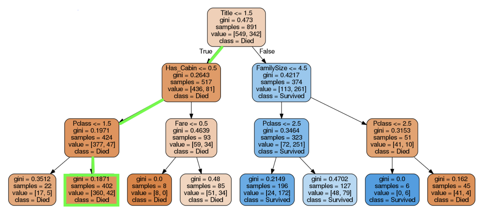
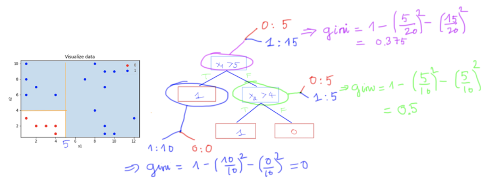

---
title: Decision Tree
---

🔙 [Back to Home](/)

## Decision tree: 

Reference link: https://machinelearningcoban.com/tabml_book/ch_model/decision_tree.html 

## Definition

Tại mỗi bước:

- Duyệt qua từng feature
- Duyệt qua từng ngưỡng của feature
- Tính gini của từng ngưỡng
- Lấy gini bé nhất để chia cây thành 2 cây nhỏ left và right

Tại sao lại lấy gini bé? 

Ví dụ khi cắt 1 ngưỡng mà cả 2 cây Left và Right bị lẫn 2 tập vào nhau (tức là k tốt) 

→ cây left có: gini = 1 - 0.5^2 - 0.5^2 = 0.5

→ cây right có: gini = 1 - 0.5^2 - 0.5^2 = 0.5

Còn ví dụ khi cắt 1 ngưỡng tốt, tức là có khả năng phân biệt, thì cây Left có tỉ lệ 0.3 0.7; còn cây Right có tỉ lệ 0.8 0.2 

→ cây left có: gini = 1 - 0.3^2 - 0.7^2 = 0.42

→ cây right có: gini =. 1 - 0.2^2 - 0.8^2 = 0.32

Tổng gini = 0.42 + 0.32

Như vậy gini càng bé chứng tỏ càng có khả năng phân tách tốt

Note: Ngoài gini còn có thể dùng entropy, logloss để chia cây

Câu hỏi: Có cần thiết phải duyệt qua hết tất cả feature lại không? Và với mỗi feature có cần duyệt hết các ngưỡng để cắt không?

trả lời từ chatgpt:

- **Thuật toán cơ bản**:
    
    Có, với feature dạng số (continuous), thuật toán sẽ xét tất cả các giá trị có thể làm ngưỡng chia. Thường là các giá trị trung điểm giữa hai quan sát liên tiếp sau khi sắp xếp.
    
- **Chi tiết**:
    - Nếu có n giá trị khác nhau cho feature đó, sẽ có tối đa n−1 ngưỡng cần xét.
        
        n → n-1
        
    - Với feature dạng phân loại (categorical), thuật toán sẽ xét các cách nhóm các category (nhưng thường dùng heuristic vì số tổ hợp rất lớn).
- **Tối ưu hóa**:
    - **Approximation**: Chỉ xét một số ngưỡng được chọn ngẫu nhiên hoặc dựa trên histogram.
    - **Pre-sorting**: Sắp xếp trước để giảm chi phí tính toán.

Câu hỏi: thực tế trong thuật toán decision tree từ sklearn thì họ dùng những kĩ thuật nào 

### **1. Không duyệt tất cả ngưỡng một cách brute-force**

- Với feature dạng số, scikit-learn **sắp xếp trước** các giá trị của feature và chỉ xét các điểm chia ở **giữa hai giá trị liên tiếp** (midpoints).

### **2. Pre-sorting và sử dụng mảng chỉ số**

- Thay vì sắp xếp lại dữ liệu ở mỗi node, scikit-learn **giữ một mảng chỉ số đã sắp xếp cho từng feature**.
→ Giúp việc tính toán nhanh hơn khi đi xuống các node con.

### **3. Giới hạn số lượng feature và ngưỡng**

- Bạn có thể điều chỉnh:
    - `max_features`: Chỉ xét một tập con ngẫu nhiên của feature tại mỗi node (giống Random Forest).
    - `max_depth`, `min_samples_split`, `min_samples_leaf`: Giới hạn độ sâu và số lượng mẫu để tránh duyệt quá nhiều.

### **4. Sử dụng Cython để tăng tốc**

- Phần lõi của thuật toán được viết bằng **Cython**, giúp tính toán impurity và tìm split nhanh hơn nhiều so với Python thuần.

### **5. Không xét tất cả tổ hợp cho feature phân loại**

- Với feature dạng categorical (nếu được mã hóa thành số), scikit-learn **chỉ xét chia theo giá trị đơn lẻ**, không xét tất cả nhóm category (vì số tổ hợp quá lớn).

### **6. Heuristic cho dữ liệu lớn**

- Với `criterion="gini"` hoặc `"entropy"`, scikit-learn tính toán impurity theo công thức tối ưu hóa để giảm số phép tính.
- Có thể dùng `splitter="random"` để chọn ngưỡng ngẫu nhiên thay vì duyệt hết (giúp tăng tốc).