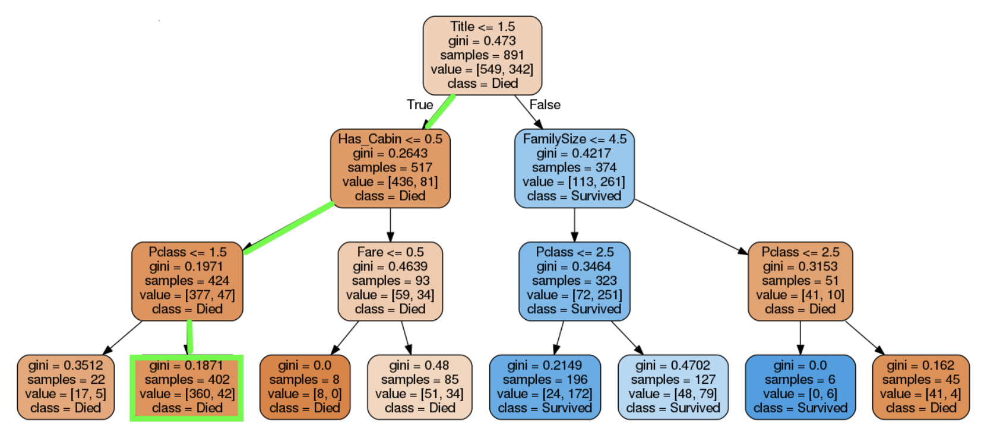
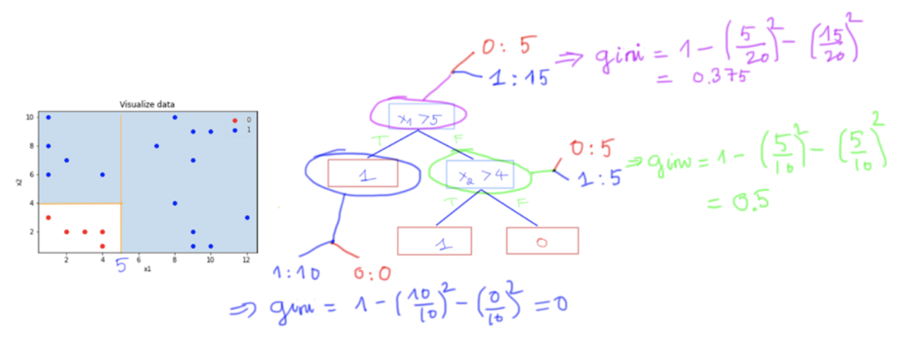


🔙 [Back to Home](/)

# Decision Trees: How a Split Is Chosen

At each node, a decision tree has one job: choose the feature and threshold that separate the target classes most clearly. Understanding that search explains both how the tree learns and why an unrestricted tree can overfit.

Reference: [Machine Learning Cơ Bản — Decision Tree](https://machinelearningcoban.com/tabml_book/ch_model/decision_tree.html)

## Search every feature for a useful threshold

For each numerical feature, the basic algorithm:

1. Sorts the observed values.
2. Places candidate thresholds between consecutive distinct values.
3. Splits the rows into left and right child nodes at each threshold.
4. Calculates the impurity after the split.
5. Chooses the feature and threshold with the largest impurity reduction.

If a feature has `n` distinct values, it has at most `n - 1` candidate thresholds.

## Lower Gini means cleaner child nodes

For a classification node, Gini impurity is:

`Gini = 1 - Σ p(k)²`

If both classes are mixed 50/50 in a child node:

`Gini = 1 - 0.5² - 0.5² = 0.50`

Suppose another split produces class proportions of 0.3/0.7 on the left and 0.8/0.2 on the right:

- Left Gini: `1 - 0.3² - 0.7² = 0.42`
- Right Gini: `1 - 0.8² - 0.2² = 0.32`

When the two child nodes contain the same number of rows, their weighted impurity is `(0.42 + 0.32) / 2 = 0.37`, lower than `0.50`. If the child sizes differ, their Gini values must be weighted by their number of rows before comparing splits.

For example, start with 10 rows split evenly between two classes, so the parent Gini is `0.50`. A candidate threshold creates:

- A left child with 3 rows from Class A and 1 from Class B: `Gini_left = 0.375`.
- A right child with 2 rows from Class A and 4 from Class B: `Gini_right ≈ 0.444`.

The child sizes are different, so the post-split impurity is:

`(4 / 10) × 0.375 + (6 / 10) × 0.444 ≈ 0.417`

The impurity reduction is approximately `0.50 - 0.417 = 0.083`. This gain—not the Gini of either child by itself—is what makes the candidate comparable with another split.

Entropy or log loss can be used instead of Gini, but the decision remains the same: prefer the split that reduces impurity the most.

## Exhaustive search does not mean testing arbitrary numbers

For a continuous feature, there is no reason to test every real number. Only boundaries between consecutive observed values can change which rows fall into the left and right nodes. Tree implementations exploit this fact instead of testing arbitrary thresholds.

The search can be reduced further in practice:

- `max_features` restricts the number of features considered at a node.
- `splitter="random"` samples candidate thresholds instead of always selecting the best one.
- Histogram-based or approximate tree algorithms group continuous values into bins.
- Compiled implementations such as scikit-learn's Cython tree code avoid Python-loop overhead.

Scikit-learn's standard decision trees do not handle categorical features natively. Integer-encoding a category makes the values look ordered, so the resulting numeric thresholds may not represent meaningful category groups.

For a category such as acquisition channel, codes `1`, `2`, and `3` do not imply a real ordering. A rule such as `channel_code <= 1.5` is therefore an artifact of the encoding unless that ordering was intentionally defined. One-hot encoding avoids the false order, but it changes the available partitions and can widen the feature space.

## Stopping rules control how much the tree memorizes

Even a useful split may create leaves that are too specific to the training data. The main controls are:

- `max_depth`: maximum number of levels.
- `min_samples_split`: minimum rows required before a node can split.
- `min_samples_leaf`: minimum rows that must remain in each child.
- `max_features`: features considered at each split.

The split criterion explains how the tree grows. These stopping rules determine when it should stop.

## Lower training impurity does not mean a better tree

If growth is unrestricted, the tree can keep creating leaves that explain smaller and smaller groups of training rows. Training impurity falls, but the rules become fragile and may not generalize.

The stopping parameters should be selected with validation data or cross-validation rather than by inspecting training accuracy. Cost-complexity pruning provides another route: grow a larger tree, then penalize additional leaves and select the subtree that gives the best validation trade-off.

The final tree should be inspected as a set of rules. A split that uses a suspicious identifier, a post-outcome field, or a category code with no real order may look statistically useful while revealing leakage or bad feature design.

Understanding Gini explains how a candidate split wins. Validation and pruning answer the separate question that matters in practice: whether the resulting rule will work on new observations.

<article class="reading-page" data-lang="en">{{ article_en | markdownify }}</article>


🔙 [Quay lại trang chủ](/)

# Decision Tree: cách chọn một split

Ở mỗi node, decision tree có một nhiệm vụ: chọn feature và threshold phân tách target class rõ nhất. Hiểu quá trình tìm kiếm này giúp giải thích cả cách cây học và lý do một cây không bị giới hạn có thể overfit.

Tham khảo: [Machine Learning Cơ Bản — Decision Tree](https://machinelearningcoban.com/tabml_book/ch_model/decision_tree.html)

## Tìm threshold hữu ích trên từng feature

Với mỗi numerical feature, thuật toán cơ bản:

1. Sắp xếp các giá trị quan sát được.
2. Đặt candidate threshold giữa những giá trị liên tiếp và khác nhau.
3. Chia các dòng vào left và right child node tại mỗi threshold.
4. Tính impurity sau khi split.
5. Chọn feature và threshold làm giảm impurity nhiều nhất.

Nếu một feature có `n` giá trị khác nhau, nó có tối đa `n - 1` candidate threshold.

## Gini thấp hơn nghĩa là child node thuần hơn

Với classification node:

`Gini = 1 - Σ p(k)²`

Nếu hai class bị trộn theo tỉ lệ 50/50 trong một child node:

`Gini = 1 - 0.5² - 0.5² = 0.50`

Giả sử một split khác tạo tỉ lệ class 0.3/0.7 ở bên trái và 0.8/0.2 ở bên phải:

- Gini bên trái: `1 - 0.3² - 0.7² = 0.42`
- Gini bên phải: `1 - 0.8² - 0.2² = 0.32`

Khi hai child node có cùng số dòng, weighted impurity là `(0.42 + 0.32) / 2 = 0.37`, thấp hơn `0.50`. Nếu kích thước hai child khác nhau, Gini phải được weighted theo số dòng trước khi so sánh split.

Ví dụ, bắt đầu với 10 dòng được chia đều cho hai class nên Gini của parent là `0.50`. Một candidate threshold tạo ra:

- Left child gồm 3 dòng Class A và 1 dòng Class B: `Gini_left = 0.375`.
- Right child gồm 2 dòng Class A và 4 dòng Class B: `Gini_right ≈ 0.444`.

Hai child có kích thước khác nhau nên impurity sau split là:

`(4 / 10) × 0.375 + (6 / 10) × 0.444 ≈ 0.417`

Impurity reduction xấp xỉ `0.50 - 0.417 = 0.083`. Gain này—không phải Gini của riêng một child—mới là giá trị dùng để so sánh candidate với split khác.

Có thể dùng entropy hoặc log loss thay cho Gini, nhưng quyết định không đổi: chọn split làm giảm impurity nhiều nhất.

## Exhaustive search không có nghĩa là thử mọi số thực

Với continuous feature, không cần thử mọi số thực. Chỉ các boundary giữa những giá trị quan sát liên tiếp mới làm thay đổi dòng nào đi vào left và right node. Tree implementation sử dụng tính chất này thay vì thử các threshold tùy ý.

Có thể giảm thêm phạm vi tìm kiếm:

- `max_features` giới hạn số feature được xét tại một node.
- `splitter="random"` lấy mẫu candidate threshold thay vì luôn chọn threshold tốt nhất.
- Histogram-based hoặc approximate tree algorithm gom continuous value vào các bin.
- Implementation được compile như Cython tree code của scikit-learn tránh overhead từ Python loop.

Standard decision tree của scikit-learn không xử lý categorical feature một cách native. Nếu encode category thành integer, cây sẽ coi chúng là có thứ tự; numeric threshold tạo ra có thể không đại diện cho nhóm category có ý nghĩa.

Với category như acquisition channel, các code `1`, `2`, `3` không hàm ý một thứ tự thực. Rule như `channel_code <= 1.5` chỉ là sản phẩm của cách encode, trừ khi thứ tự đó được định nghĩa có chủ đích. One-hot encoding tránh thứ tự giả nhưng thay đổi các partition có thể tạo và làm rộng feature space.

## Stopping rule kiểm soát mức độ cây ghi nhớ dữ liệu

Ngay cả một split hữu ích cũng có thể tạo leaf quá riêng cho training data. Các tham số chính gồm:

- `max_depth`: số level tối đa.
- `min_samples_split`: số dòng tối thiểu để một node được split.
- `min_samples_leaf`: số dòng tối thiểu phải còn lại ở mỗi child.
- `max_features`: số feature được xét ở mỗi split.

Split criterion giải thích cây phát triển thế nào. Các stopping rule quyết định khi nào cây phải dừng.

## Training impurity thấp hơn không đồng nghĩa cây tốt hơn

Nếu không giới hạn tăng trưởng, cây có thể tiếp tục tạo leaf để giải thích những nhóm training row ngày càng nhỏ. Training impurity giảm nhưng các rule trở nên mong manh và có thể không generalize.

Các stopping parameter cần được chọn bằng validation data hoặc cross-validation, không phải bằng training accuracy. Cost-complexity pruning là một hướng khác: phát triển một cây lớn hơn, sau đó phạt leaf bổ sung và chọn subtree có validation trade-off tốt nhất.

Cây cuối cùng cần được kiểm tra như một tập rule. Split sử dụng identifier đáng ngờ, field xuất hiện sau outcome hoặc category code không có thứ tự thực có thể trông hữu ích về mặt thống kê nhưng thực chất cho thấy leakage hoặc feature design sai.

Hiểu Gini giải thích vì sao một candidate split chiến thắng. Validation và pruning trả lời câu hỏi thực tế khác: rule tạo ra có hoạt động trên observation mới hay không.

<article class="reading-page" data-lang="vi">{{ article_vi | markdownify }}</article>
