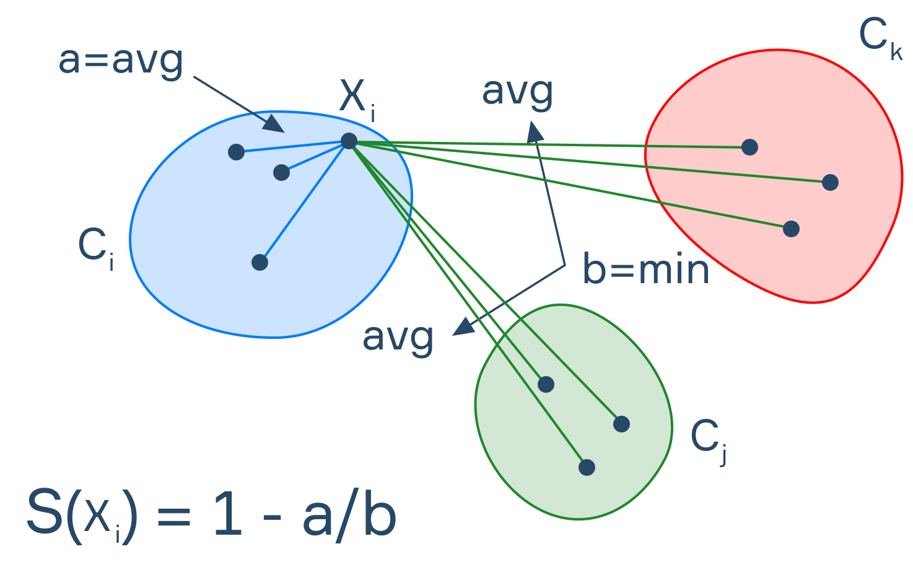

🔙 [Back to Home](/)

## Kmeans

## Definition
Kmeans là 1 thuật toán phân cụm, với tập N điểm cho trước, có thể phân về k cụm dựa trên khoảng cách với các tâm cụm.  

Kmeans là thuật toán Unsupervised learning, tức là bài toán k có nhãn, vì vậy khó (k clear) để đánh giá kết quả thuật toán, cũng như không tìm được nghiệm tốt nhât.  

## Ứng dụng Kmeans

Trên thực tế trong bank, có một vài bài toán áp dụng Kmeans. Ví dụ 1 tập KH mua bảo hiểm, liệu tập này có thể chia về các tập mà có chân dung (feature) giống nhau không. Output trả ra có dạng kiểu Tập 1: KH trên 35 tuổi, có AUM tốt,có nhiều giao dịch mua thuốc/ khám bệnh, ...  

Tuy nhiên trải nghiệm thực tế áp dụng Kmeans trong các bài toán này, Kmeans mang tính am hiểu khách hàng, am hiểu kinh doanh nhiều hơn là việc giải quyết 1 bài toán cụ thể (classification)

## Các bước trong thuật toán

B1: Chọn k là số cụm muốn phân vào

B2: Khởi tạo ngẫu nhiên = chọn k điểm - gọi đây là k centroid

khi có 1 điểm mới → phân vào cụm gần nhất → update lại centroid của cụm đó

B3: lặp lại cho đến khi hết các điểm → kết thúc sẽ được k cluster 

## Các điểm cần chú ý 

Làm thế nào để chọn được K phù hơp:

Dựa vào 2 thứ: Elbow curve và Silhouette score

Elbow curve = tổng (distance từ các điểm đến centroid) 

Silhouette = avg (s(i)) trong đó s(i) = ( b(i) - a(i) ) / max( b(i), a(i) ) 

- a(i): trung bình kc từ điểm i tới các điểm khác trong cụm
- b(i): trung bình kc từ điểm i tới cụm gần nhất

Khi tăng K lên 

- Elbow giảm → tốt lên
- Siouse giảm → xấu đi

Cần chọn K để cân bằng cho cả 2.

