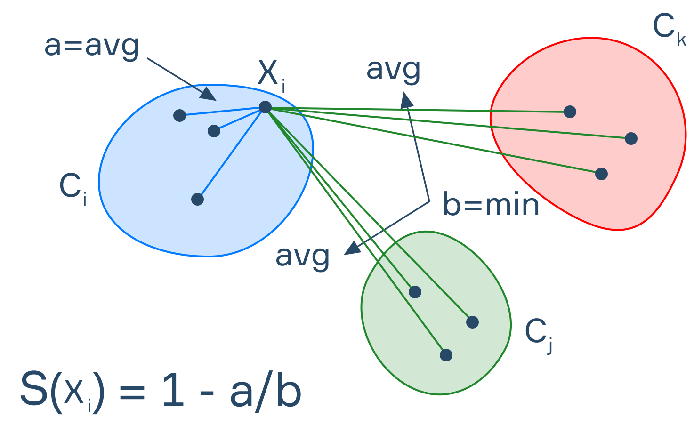


🔙 [Back to Home](/)

# K-Means in Banking: Useful for Profiles, Not Labels

K-means can divide customers into groups with similar features, but it does not discover objectively correct customer segments. In my banking work, its value has been narrower and more useful: it turns a large customer table into a small number of profiles that analysts and business teams can inspect.

## The business question comes before the clusters

The use case starts with customers who have already purchased insurance. The question is not “Who will buy insurance?”—that would require a labeled, supervised-learning problem. The question is “What different customer profiles exist inside the insurance portfolio?”

K-means can reveal a profile such as customers over 35 with high assets under management and frequent medicine or medical-examination transactions. This can support portfolio analysis and a more concrete discussion with the business, but the algorithm does not explain why those customers bought insurance or prove that the profile will remain stable.

There is no known target label in this task. A cluster number such as `2` has no business meaning until we inspect the customers and features assigned to it.

## One row must represent one customer over one fixed window

Before choosing `K`, the analysis needs a customer-level feature table. Each row represents one customer, and every behavioral feature must be calculated over the same observation window. Relevant features for this use case include:

- Age.
- Assets under management.
- Number or frequency of medicine-purchase transactions.
- Number or frequency of medical-examination transactions.

The observation window matters. A count over one month is not comparable with a count over twelve months, and mixing windows can create clusters that reflect feature construction rather than customer behavior.

Feature definitions also need to remain interpretable. If the business cannot explain what a high or low value means, it will be difficult to explain the resulting centroid.

## Scaling decides what “similar customer” means

K-means usually relies on Euclidean distance. Without scaling, a monetary feature such as assets under management can dominate age or transaction frequency simply because it has a larger numeric range.

For this use case, the preparation step should therefore:

1. Treat missing values consistently rather than allowing absence to become an accidental segment.
2. Inspect highly skewed monetary and count features and apply a transformation when justified.
3. Scale the final numeric features before calculating distances.
4. Keep the transformation parameters so cluster profiles can later be translated back into business units.

This is not cosmetic preprocessing. Changing the scale changes the nearest centroid and can change the segment assigned to a customer.

## K-means alternates assignment and centroid updates

Given `N` data points, K-means assigns them to `K` clusters according to their distance from the cluster centroids:

1. Choose `K`, the number of clusters.
2. Initialize `K` centroids, often from selected data points.
3. Assign every point to its nearest centroid.
4. Recalculate each centroid from the points assigned to that cluster.
5. Repeat assignment and update until the assignments or centroids stop changing enough.

Because the initial centroids affect the final result, different initializations can produce different clusters. Running several initializations reduces the chance of reporting a poor local solution from one unlucky starting point.

## Inertia cannot choose K by itself

The elbow curve uses within-cluster distance, commonly called inertia: the sum of squared distances from each point to its assigned centroid.

Increasing `K` gives the algorithm more centroids, so inertia cannot increase. The smallest inertia therefore does not identify the best `K`; choosing one cluster per customer would minimize it without producing a useful segmentation. The elbow is the point after which additional clusters reduce inertia only slightly, but the bend is not always unambiguous.

## Silhouette checks separation as well as compactness

For point `i`, the silhouette value is:

`s(i) = (b(i) - a(i)) / max(b(i), a(i))`

- `a(i)`: average distance from point `i` to other points in its own cluster.
- `b(i)`: lowest average distance from point `i` to points in another cluster.

The silhouette score is the average of `s(i)` across all points. A higher value means points are closer to their own cluster than to neighboring clusters.

Unlike inertia, silhouette does not move in one guaranteed direction as `K` increases. It helps compare candidate values of `K`, but its highest value is not automatically the best business choice. A solution with slightly lower silhouette may be preferable if its profiles are stable, sufficiently large, and meaningfully different.

## A useful cluster needs a profile, not just an ID

For each candidate value of `K`, I use the elbow and silhouette together, then build a profiling table. At minimum, that table should contain:

| Profile field | Question it answers |
| --- | --- |
| Customer count and share | Is the cluster large enough to matter? |
| Median age and assets under management | What does a typical customer in the cluster look like? |
| Medicine and medical-examination transaction frequency | Which behavior separates this cluster from the others? |
| Difference from the full portfolio | Is the profile distinctive or merely average? |

Centroids are calculated in the transformed feature space. For interpretation, the values should be converted back to understandable units where possible. The final names should describe the profile—such as “higher assets, frequent healthcare transactions”—rather than expose arbitrary labels such as “Cluster 2.”

## Stability matters more than one attractive chart

A segmentation is difficult to use if its profiles change whenever the random seed or observation period changes. I therefore treat stability as a separate check:

- Run K-means with multiple initializations.
- Compare profiles across nearby values of `K`.
- Recalculate the segmentation on another observation window.
- Compare the profile characteristics rather than the numeric cluster IDs, because those IDs can be permuted between runs.

If a small change in the data produces entirely different profiles, the segmentation is describing a fragile partition rather than a repeatable customer pattern.

## Where K-means can give the wrong picture

K-means works best when Euclidean distance is meaningful and clusters are reasonably compact. It becomes less reliable when:

- Outliers pull a centroid away from the typical customer.
- Clusters have very different sizes or densities.
- The underlying groups have irregular, non-spherical shapes.
- Categorical variables are inserted as arbitrary integer codes.
- Too many weak features make distance less informative.

These limits explain why elbow and silhouette scores are necessary but insufficient. The final result still needs feature-level inspection and a business interpretation.

The output of this analysis is a set of descriptive profiles, not a prediction of who will buy insurance. If the goal changes to predicting purchase propensity, the cluster profile may become an exploratory feature, but it does not replace a supervised model and an out-of-sample evaluation.

<article class="reading-page" data-lang="en">{{ article_en | markdownify }}</article>


🔙 [Quay lại trang chủ](/)

# K-means trong ngân hàng: hữu ích cho chân dung, không phải nhãn

K-means có thể chia khách hàng thành những nhóm có feature tương tự, nhưng không khẳng định các nhóm đó đúng một cách khách quan. Trong công việc ngân hàng của tôi, giá trị chính của K-means là giúp hiểu chân dung khách hàng thay vì giải quyết một bài toán classification cụ thể.

## Một use case ngân hàng: hiểu nhóm khách hàng mua bảo hiểm

Giả sử có một tập khách hàng đã mua bảo hiểm. K-means có thể cho thấy các nhóm như khách hàng trên 35 tuổi, có assets under management cao và thường xuyên phát sinh giao dịch mua thuốc hoặc khám bệnh.

Output này hữu ích khi khám phá portfolio và thảo luận hành vi khách hàng với business. Nó khác classification: không có target label đã biết, và cluster number tự nó không mang business meaning cho đến khi chúng ta kiểm tra feature của khách hàng trong cluster.

## K-means luân phiên assignment và cập nhật centroid

Với `N` data point, K-means gán chúng vào `K` cluster theo khoảng cách tới cluster centroid:

1. Chọn `K`, số cluster.
2. Khởi tạo `K` centroid, thường từ các data point được chọn.
3. Gán mỗi point vào centroid gần nhất.
4. Tính lại từng centroid từ các point thuộc cluster đó.
5. Lặp lại assignment và update cho đến khi assignment hoặc centroid gần như không đổi.

Vì centroid ban đầu ảnh hưởng đến kết quả cuối, các initialization khác nhau có thể tạo ra cluster khác nhau.

## Inertia luôn giảm khi K tăng

Elbow curve sử dụng within-cluster distance, thường gọi là inertia: tổng squared distance từ từng point đến centroid được gán.

Khi tăng `K`, thuật toán có thêm centroid nên inertia không thể tăng. Vì thế, inertia nhỏ nhất không xác định được `K` tốt nhất; nếu mỗi point là một cluster thì inertia sẽ nhỏ nhất nhưng segmentation không có ích. Elbow là điểm mà thêm cluster mới chỉ làm inertia giảm một lượng nhỏ.

## Silhouette kiểm tra cả độ tách biệt và độ chặt

Với point `i`:

`s(i) = (b(i) - a(i)) / max(b(i), a(i))`

- `a(i)`: khoảng cách trung bình từ point `i` đến các point khác trong cùng cluster.
- `b(i)`: khoảng cách trung bình nhỏ nhất từ point `i` đến các point thuộc một cluster khác.

Silhouette score là trung bình của `s(i)` trên toàn bộ point. Giá trị cao hơn nghĩa là point gần cluster của nó hơn các cluster lân cận.

Khác với inertia, silhouette không có một chiều biến động cố định khi `K` tăng. Tôi dùng elbow và silhouette cùng nhau, sau đó kiểm tra các customer profile thu được có khác biệt và có thể giải thích với business hay không.

Bước kiểm tra cuối cùng rất quan trọng: một cluster tách biệt về mặt toán học chưa chắc là một customer segment hữu ích.

<article class="reading-page" data-lang="vi">{{ article_vi | markdownify }}</article>
