
🔙 [Back to Home](/)

# Linear Regression: Two Solvers and the Checks After Fitting

Linear regression is useful for more than predicting a continuous value. Its coefficients also describe how the expected outcome changes with the input variables—but that interpretation is only reliable after checking whether the model assumptions are reasonable.

## One model, from one feature to polynomial features

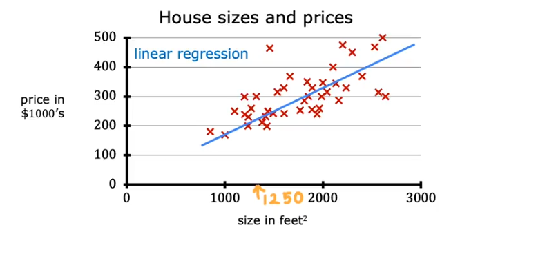

- One input variable:

    y = w*x + b

- Multiple input variables:

    y = w1*x1 + w2*x2 + … + wn*xn + b

- Polynomial terms treated as engineered input features:

    y = w1*x1 + w2*x1^2 + … + b

## Use it for prediction or for understanding relationships

- Predict a continuous output such as house price, stock value, or credit score.
- Examine a relationship, such as whether a higher interest rate is associated with a higher total savings-book balance.

## Fit the same model in two ways

Given `x` and `y`, the coefficients can be estimated iteratively with gradient descent or directly with matrix operations. Implementing both makes the difference between optimization and a closed-form solution concrete.

- Gradient descent
- Matrix

## Gradient descent updates the slope and intercept iteratively

### Step 1: Initialize `w` and `b`

```python
# initialize w

w_init = -0.01
w_init

# initialize b

b_init = 46
b_init

learning_rate = 0.0000001
loss_history = []
w_history = []
b_history = []
```

### Step 2: Calculate mean squared error

```
def calculate_mse(y_pred, y):
    mse = 0
    for i in range(len(y)):
        mse += ((y_pred[i] - y[i])**2)/len(y)

    return mse
```

### Step 3: Calculate the gradients

```python
def grad_y_by_w(w, b, x, y):
    tot_grad = 0
    for ele in range(len(x)):
        tot_grad += (1/len(x))*(w*x[ele] + b - y[ele])*x[ele]
    return tot_grad

def grad_y_by_b(w, b, x, y):
    tot_grad = 0
    for ele in range(len(x)):
        tot_grad += (1/len(x))*(w*x[ele] + b - y[ele])
    return tot_grad

```

### Step 4: Update `w` and `b` over multiple epochs

```python
for epoch in range(30):
    print("================================")
    print(f"Run for epoch {epoch}")

    if epoch == 0:
        w = w_init
        b = b_init
        y_pred = w*x + b

    if epoch >= 1:
        grad_l_by_w = grad_y_by_w(w, b, x, y)
        grad_l_by_b = grad_y_by_b(w, b, x, y)
        print(grad_l_by_w)
        print(grad_l_by_b)

        w = w - learning_rate*grad_l_by_w
        b = b - learning_rate*grad_l_by_b

        print("w: ", w)
        print("b: ", b)

        y_pred = w*x + b


    loss = calculate_mse(y_pred, y)
    # print(loss)
    loss_history.append(loss)
    print("Loss: ", loss)
    w_history.append(w)
    b_history.append(b)

```

### Step 5: Compare with scikit-learn

```python
import numpy as np
from sklearn.linear_model import LinearRegression, SGDRegressor

# data
X = np.array([[1], [2], [3], [4], [5]], dtype=float)
y = np.array([1.2, 1.9, 3.2, 3.9, 5.1])

# exact OLS
lr = LinearRegression().fit(X, y)
print("LinearRegression coef:", lr.coef_, "intercept:", lr.intercept_)

# gradient descent version
sgd = SGDRegressor(max_iter=10000, eta0=0.01, learning_rate='constant').fit(X, y)
print("SGDRegressor coef:", sgd.coef_, "intercept:", sgd.intercept_)

```

## Matrix operations give a direct solution

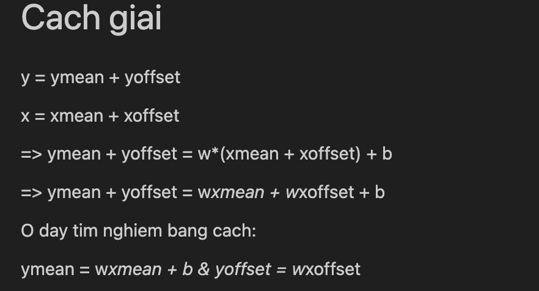

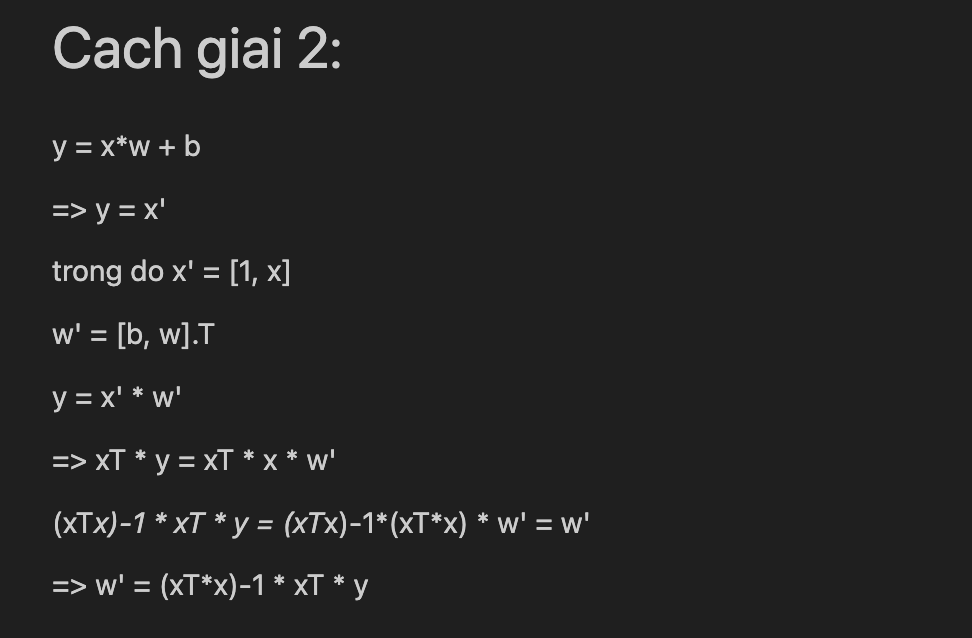

The following notebook snippets calculate the intercept and slope from the design matrix and from centered variables.

```python
n = len(x)
x_temp = np.concatenate([np.ones((n, 1)), np.reshape(x, (n,1))], axis=1)

x_temp

w_temp = np.linalg.inv((x_temp.T) @ x_temp) @ (x_temp.T) @ y

w_temp

b = w_temp[0]
w = w_temp[1]
```

```python
ymean = y.mean()

xmean = x.mean()

ymean

yoffset = y - ymean
xoffset = x - xmean

yoffset

w = (xoffset.T @ yoffset) / (xoffset.T @ xoffset)

w

b = ymean - xmean*w
b
```

The first form follows the normal equation directly. In production code, `np.linalg.lstsq` is preferable to explicitly calculating a matrix inverse, especially when predictors are close to linearly dependent.

## Benchmark iterative and direct solvers

```python
import time
import numpy as np
from sklearn.linear_model import LinearRegression, SGDRegressor

def benchmark(n_samples, n_features):
    X = np.random.randn(n_samples, n_features)
    y = np.random.randn(n_samples)

    # LinearRegression
    start = time.time()
    try:
        LinearRegression().fit(X, y)
        lr_time = time.time() - start
    except Exception as e:
        lr_time = str(e)

    # SGDRegressor
    start = time.time()
    SGDRegressor(max_iter=1000).fit(X, y)
    sgd_time = time.time() - start

    return lr_time, sgd_time

sizes = [(1000, 1000), (2000, 2000), (5000, 5000), (10000, 1000), (1000, 10000)]
for n, d in sizes:
    print(f"n={n}, d={d}:", benchmark(n, d))

```

The larger cases in this benchmark allocate dense matrices and can require substantial memory; they should be run individually rather than treated as a lightweight example.

## Check the assumptions after fitting

The fitted coefficients and predictions are not the end of the analysis. The residuals help show whether the linear model is a reasonable description of the data.

| Assumption | How to check it | Tool |
| --- | --- | --- |
| Linearity | Plot residuals against fitted values | `sns.residplot()` |
| Independent errors | Check serial correlation; Durbin–Watson is useful for ordered or time-series data | `durbin_watson()` |
| Constant variance | Inspect residuals versus fitted values or run a Breusch–Pagan test | `statsmodels` |
| Approximately normal residuals | Use a Q–Q plot, histogram, or Shapiro–Wilk test | `shapiro()`, `qqplot()` |
| No severe multicollinearity | Calculate the Variance Inflation Factor | `variance_inflation_factor()` |

### Inspect the residual distribution visually

For the Shapiro–Wilk test:

- `H₀`: the residuals follow a normal distribution.
- If `p < 0.05`, reject `H₀`.

With a large sample, even a small departure from normality can produce a very small p-value. A Q–Q plot and histogram show whether that departure is material rather than merely detectable.

Q–Q plot:

```python
import statsmodels.api as sm
import matplotlib.pyplot as plt

sm.qqplot(np.array(resid), line='45', fit=True)
plt.show()
```

Histogram:

```python
import seaborn as sns
import matplotlib.pyplot as plt

sns.histplot(resid, kde=True)
plt.show()
```

## VIF exposes predictors that repeat the same information

To calculate the VIF for feature `Xᵢ`, regress it on the remaining predictors and use the resulting `Rᵢ²`:

`VIF_i = 1 / (1 - R_i²)`

A VIF above 5 corresponds to `Rᵢ² > 0.8` and is a signal to inspect the feature. It is a diagnostic threshold, not an automatic instruction to delete the variable.

```python
import pandas as pd
from statsmodels.stats.outliers_influence import variance_inflation_factor
from statsmodels.tools.tools import add_constant

# X is a DataFrame containing the predictors
X = add_constant(x)

vif_data = pd.DataFrame()
vif_data["feature"] = X.columns
vif_data["VIF"] = [variance_inflation_factor(X.values, i) for i in range(X.shape[1])]

print(vif_data)
```

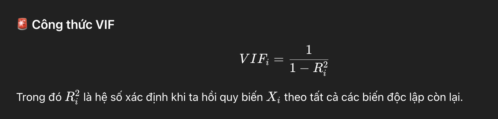

## Three responses to multicollinearity

When several predictors carry overlapping information, there are three practical options:

1. Remove predictors that duplicate information already represented elsewhere.
2. Combine correlated predictors, for example with Principal Component Analysis.
3. Use regularization such as Ridge or Lasso.

The choice depends on the goal. Removing or combining features changes interpretation; regularization keeps the model predictive while shrinking unstable coefficients.

## PCA keeps directions with the most variance

For a square matrix `A`, an eigenvector `v` and eigenvalue `λ` satisfy:

`Av = λv`

Multiplying `v` by `A` changes its scale by `λ` without changing its direction.

In PCA, `A` is the covariance matrix. Each eigenvalue measures how much variance is retained along its corresponding eigenvector. Sorting eigenvalues from largest to smallest ranks the principal-component directions by the information they retain.

The explained-variance ratio is used to select the first `k` components—for example, enough components to retain 95% of the variance.

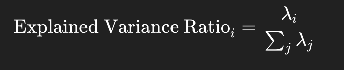

An `n × n` covariance matrix has `n` eigenvalue–eigenvector pairs:

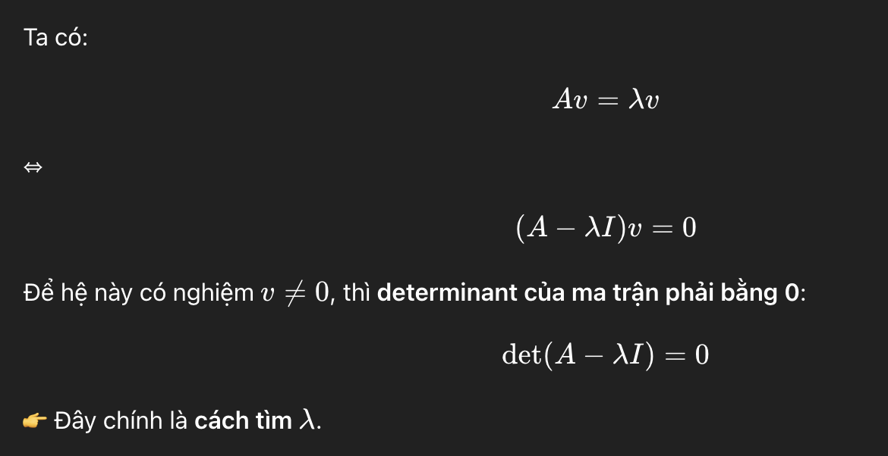

Placing the selected eigenvectors into a projection matrix transforms the original `m` features into `k` principal components. This reduces dimension, but the new components are combinations of the original variables and are therefore less direct to interpret.

## Ridge and Lasso keep the predictors but penalize coefficients

Ridge adds an L2 penalty and shrinks correlated coefficients. Lasso adds an L1 penalty and can reduce some coefficients to exactly zero.

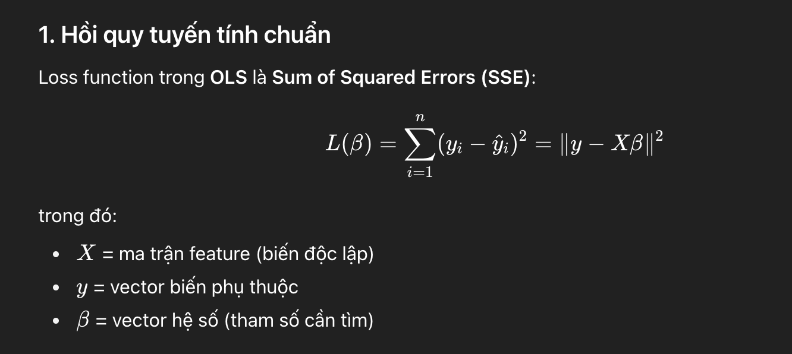

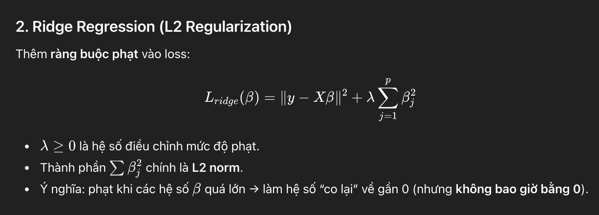

### Ridge solution

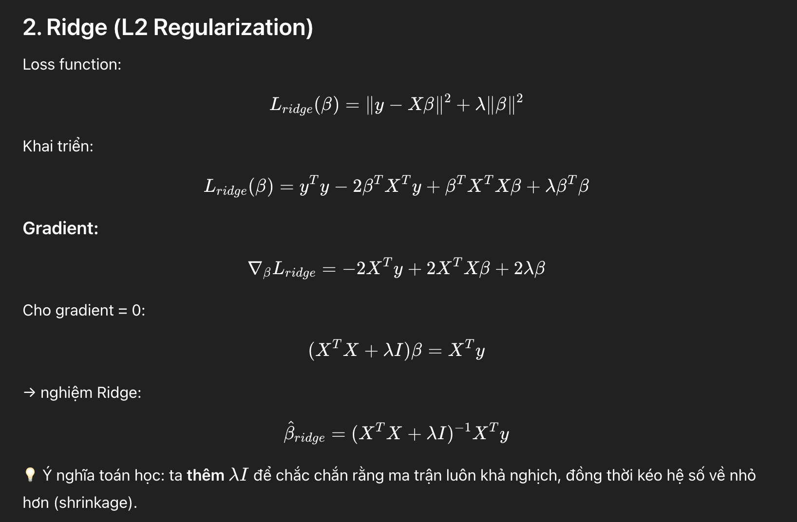

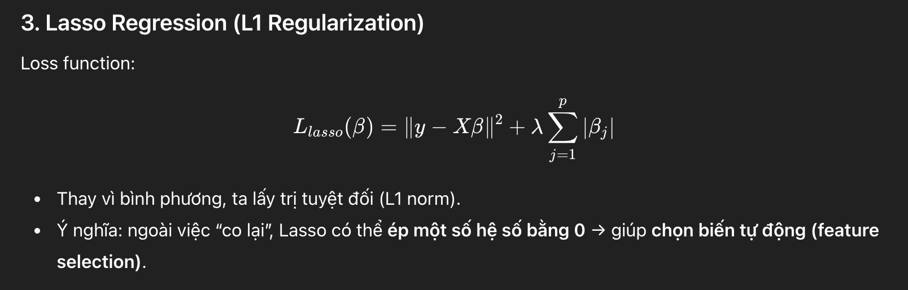

### Lasso solution

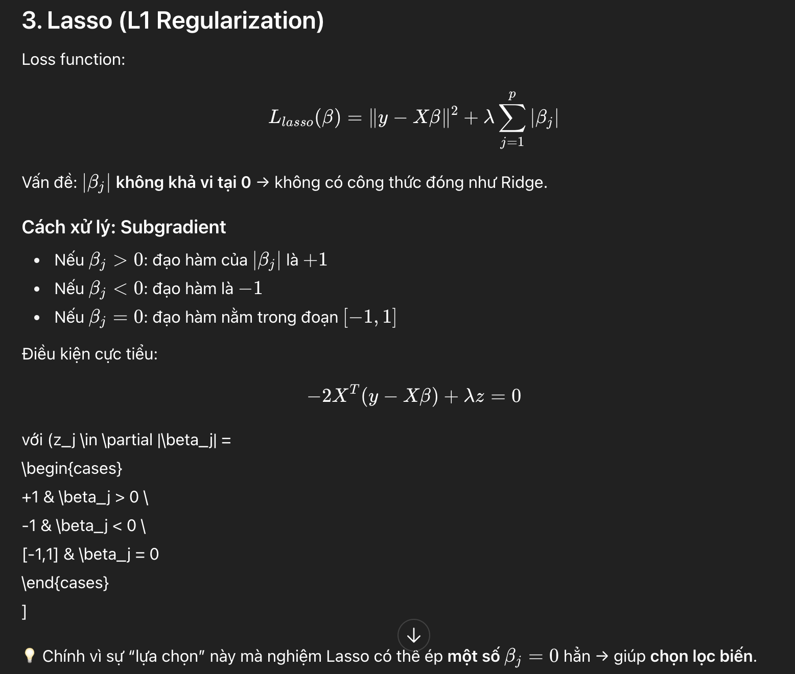

<article class="reading-page" data-lang="en">{{ article_en | markdownify }}</article>


🔙 [Quay lại trang chủ](/)

# Linear Regression: hai cách giải và các kiểm tra sau khi fit

Linear regression không chỉ dùng để dự báo một giá trị liên tục. Các coefficient còn mô tả expected outcome thay đổi thế nào theo input variable—nhưng cách diễn giải đó chỉ đáng tin sau khi kiểm tra các assumption của mô hình có hợp lý hay không.

## Một mô hình, từ một feature đến polynomial features


- Một input variable:

    y = w*x + b

- Nhiều input variable:

    y = w1*x1 + w2*x2 + … + wn*xn + b

- Polynomial term được xem như input feature mới tạo bằng feature engineering:

    y = w1*x1 + w2*x1^2 + … + b

## Dùng cho prediction hoặc để hiểu mối quan hệ

- Dự báo output liên tục như giá nhà, giá cổ phiếu hoặc credit score.
- Kiểm tra một mối quan hệ, chẳng hạn lãi suất cao hơn có liên hệ với tổng số dư sổ tiết kiệm cao hơn hay không.

## Fit cùng một mô hình theo hai cách

Với `x` và `y`, các coefficient có thể được ước lượng theo cách lặp bằng gradient descent hoặc giải trực tiếp bằng matrix operations. Tự triển khai cả hai giúp nhìn rõ khác biệt giữa optimization và closed-form solution.

## Gradient descent cập nhật slope và intercept theo từng vòng lặp

### Bước 1: Khởi tạo `w` và `b`

```python
# initialize w

w_init = -0.01
w_init

# initialize b

b_init = 46
b_init

learning_rate = 0.0000001
loss_history = []
w_history = []
b_history = []
```

### Bước 2: Tính mean squared error

```
def calculate_mse(y_pred, y):
    mse = 0
    for i in range(len(y)):
        mse += ((y_pred[i] - y[i])**2)/len(y)

    return mse
```

### Bước 3: Tính gradient

```python
def grad_y_by_w(w, b, x, y):
    tot_grad = 0
    for ele in range(len(x)):
        tot_grad += (1/len(x))*(w*x[ele] + b - y[ele])*x[ele]
    return tot_grad

def grad_y_by_b(w, b, x, y):
    tot_grad = 0
    for ele in range(len(x)):
        tot_grad += (1/len(x))*(w*x[ele] + b - y[ele])
    return tot_grad

```

### Bước 4: Cập nhật `w` và `b` qua nhiều epoch

```python
for epoch in range(30):
    print("================================")
    print(f"Run for epoch {epoch}")

    if epoch == 0:
        w = w_init
        b = b_init
        y_pred = w*x + b

    if epoch >= 1:
        grad_l_by_w = grad_y_by_w(w, b, x, y)
        grad_l_by_b = grad_y_by_b(w, b, x, y)
        print(grad_l_by_w)
        print(grad_l_by_b)

        w = w - learning_rate*grad_l_by_w
        b = b - learning_rate*grad_l_by_b

        print("w: ", w)
        print("b: ", b)

        y_pred = w*x + b


    loss = calculate_mse(y_pred, y)
    # print(loss)
    loss_history.append(loss)
    print("Loss: ", loss)
    w_history.append(w)
    b_history.append(b)

```

### Bước 5: So sánh với scikit-learn

```python
import numpy as np
from sklearn.linear_model import LinearRegression, SGDRegressor

# data
X = np.array([[1], [2], [3], [4], [5]], dtype=float)
y = np.array([1.2, 1.9, 3.2, 3.9, 5.1])

# exact OLS
lr = LinearRegression().fit(X, y)
print("LinearRegression coef:", lr.coef_, "intercept:", lr.intercept_)

# gradient descent version
sgd = SGDRegressor(max_iter=10000, eta0=0.01, learning_rate='constant').fit(X, y)
print("SGDRegressor coef:", sgd.coef_, "intercept:", sgd.intercept_)

```

## Matrix operations cho nghiệm trực tiếp


Các notebook snippet dưới đây tính intercept và slope từ design matrix và từ các biến đã centered.

```python
n = len(x)
x_temp = np.concatenate([np.ones((n, 1)), np.reshape(x, (n,1))], axis=1)

x_temp

w_temp = np.linalg.inv((x_temp.T) @ x_temp) @ (x_temp.T) @ y

w_temp

b = w_temp[0]
w = w_temp[1]
```

```python
ymean = y.mean()

xmean = x.mean()

ymean

yoffset = y - ymean
xoffset = x - xmean

yoffset

w = (xoffset.T @ yoffset) / (xoffset.T @ xoffset)

w

b = ymean - xmean*w
b
```

Cách đầu tiên đi trực tiếp theo normal equation. Trong production code, `np.linalg.lstsq` phù hợp hơn việc tính matrix inverse, đặc biệt khi các predictor gần linearly dependent.

## Benchmark iterative solver và direct solver

```python
import time
import numpy as np
from sklearn.linear_model import LinearRegression, SGDRegressor

def benchmark(n_samples, n_features):
    X = np.random.randn(n_samples, n_features)
    y = np.random.randn(n_samples)

    # LinearRegression
    start = time.time()
    try:
        LinearRegression().fit(X, y)
        lr_time = time.time() - start
    except Exception as e:
        lr_time = str(e)

    # SGDRegressor
    start = time.time()
    SGDRegressor(max_iter=1000).fit(X, y)
    sgd_time = time.time() - start

    return lr_time, sgd_time

sizes = [(1000, 1000), (2000, 2000), (5000, 5000), (10000, 1000), (1000, 10000)]
for n, d in sizes:
    print(f"n={n}, d={d}:", benchmark(n, d))

```

Các trường hợp lớn trong benchmark tạo dense matrix và có thể cần nhiều memory; nên chạy riêng từng trường hợp thay vì xem đây là một ví dụ nhẹ.

## Kiểm tra assumption sau khi fit

Coefficient và prediction chưa phải điểm kết thúc. Residual giúp kiểm tra linear model có mô tả dữ liệu hợp lý hay không.

| Assumption | Cách kiểm tra | Tool |
| --- | --- | --- |
| Linearity | Vẽ residual theo fitted value | `sns.residplot()` |
| Error độc lập | Kiểm tra serial correlation; Durbin–Watson hữu ích cho dữ liệu có thứ tự hoặc time series | `durbin_watson()` |
| Phương sai không đổi | Xem residual theo fitted value hoặc chạy Breusch–Pagan test | `statsmodels` |
| Residual gần phân phối chuẩn | Dùng Q–Q plot, histogram hoặc Shapiro–Wilk test | `shapiro()`, `qqplot()` |
| Không có multicollinearity nghiêm trọng | Tính Variance Inflation Factor | `variance_inflation_factor()` |

### Kiểm tra trực quan phân phối residual

Với Shapiro–Wilk test:

- `H₀`: residual tuân theo phân phối chuẩn.
- Nếu `p < 0.05`, bác bỏ `H₀`.

Khi sample lớn, chỉ một sai lệch nhỏ khỏi phân phối chuẩn cũng có thể tạo p-value rất nhỏ. Q–Q plot và histogram giúp phân biệt sai lệch thực sự đáng kể với sai lệch chỉ có thể phát hiện về mặt thống kê.

Q–Q plot:

```python
import statsmodels.api as sm
import matplotlib.pyplot as plt

sm.qqplot(np.array(resid), line='45', fit=True)
plt.show()
```

Histogram:

```python
import seaborn as sns
import matplotlib.pyplot as plt

sns.histplot(resid, kde=True)
plt.show()
```

## VIF phát hiện các predictor lặp lại cùng một thông tin

Để tính VIF cho feature `Xᵢ`, regress nó theo các predictor còn lại và dùng `Rᵢ²` thu được:

`VIF_i = 1 / (1 - R_i²)`

VIF lớn hơn 5 tương ứng với `Rᵢ² > 0.8` và là tín hiệu cần kiểm tra feature. Đây là diagnostic threshold, không phải yêu cầu tự động xóa biến.

```python
import pandas as pd
from statsmodels.stats.outliers_influence import variance_inflation_factor
from statsmodels.tools.tools import add_constant

# X is a DataFrame containing the predictors
X = add_constant(x)

vif_data = pd.DataFrame()
vif_data["feature"] = X.columns
vif_data["VIF"] = [variance_inflation_factor(X.values, i) for i in range(X.shape[1])]

print(vif_data)
```


## Ba cách xử lý multicollinearity

Khi nhiều predictor chứa thông tin trùng nhau, có ba lựa chọn thực tế:

1. Bỏ predictor trùng với thông tin đã có ở biến khác.
2. Kết hợp các predictor tương quan, chẳng hạn bằng Principal Component Analysis.
3. Dùng regularization như Ridge hoặc Lasso.

Lựa chọn phụ thuộc vào mục tiêu. Bỏ hoặc kết hợp feature làm thay đổi khả năng diễn giải; regularization giữ mô hình phục vụ prediction nhưng thu nhỏ các coefficient thiếu ổn định.

## PCA giữ các hướng có nhiều variance nhất

Với square matrix `A`, eigenvector `v` và eigenvalue `λ` thỏa mãn:

`Av = λv`

Nhân `v` với `A` làm thay đổi độ lớn theo `λ` nhưng không đổi hướng.

Trong PCA, `A` là covariance matrix. Mỗi eigenvalue đo lượng variance được giữ trên eigenvector tương ứng. Sắp xếp eigenvalue từ lớn đến nhỏ giúp xếp hạng các principal-component direction theo lượng thông tin chúng giữ lại.

Explained-variance ratio được dùng để chọn `k` component đầu tiên—ví dụ, số component đủ để giữ 95% variance.


Một covariance matrix `n × n` có `n` cặp eigenvalue–eigenvector:


Đưa các eigenvector được chọn vào projection matrix sẽ biến đổi `m` feature ban đầu thành `k` principal component. Cách này giảm số chiều, nhưng component mới là tổ hợp của các biến ban đầu nên khó diễn giải trực tiếp hơn.

## Ridge và Lasso giữ predictor nhưng phạt coefficient

Ridge thêm L2 penalty và thu nhỏ các coefficient tương quan. Lasso thêm L1 penalty và có thể đưa một số coefficient về đúng 0.


### Nghiệm Ridge


### Nghiệm Lasso



<article class="reading-page" data-lang="vi">{{ article_vi | markdownify }}</article>
