🔙 [Back to Home](/)

## Linear regression


# Definition

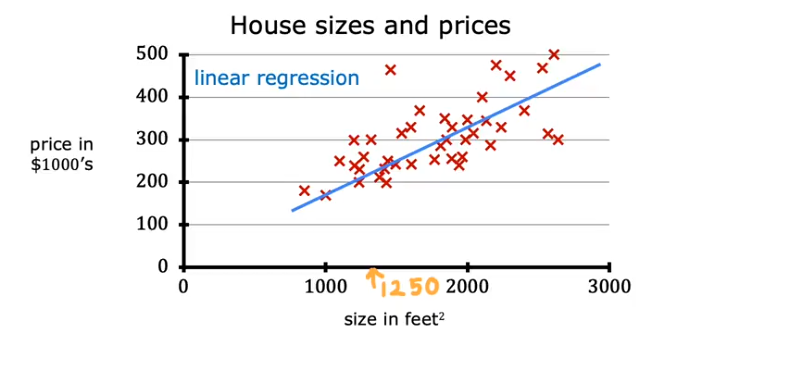

Linear regression 1 variable

y = w*x + b

Linear regression for multiple variable

y = w1*x1 + w2*x2 + … + wn*xn + b

Linear regression with polymonial variable (treat polynorminal as new variable by feature engineering)

y = w1*x1 + w2*x1^2 + … + b

1. Application

Use linear regression in :

- Predict continuous output: house price, stock, creidt score,…
- 
1. Solving

2 ways to solve linear regression:

- Gradient descent
- Matrix

Detail solution:

- Gradient descent

 Step 1: Init w & b

```python
# khoi tao w

w_init = -0.01
w_init

# khoi tao b

b_init = 46
b_init

learning_rate = 0.0000001
loss_history = []
w_history = []
b_history = []
```

Step 2: write mse calculation

```
def calculate_mse(y_pred, y):
    mse = 0
    for i in range(len(y)):
        mse += ((y_pred[i] - y[i])**2)/len(y)
    
    return mse
```

Step 3: write gradient descent calculation

```python
def grad_y_by_w(w, b, x, y):
    tot_grad = 0
    for ele in range(len(x)):
        tot_grad += (1/len(x))*(w*x[ele] + b - y[ele])*x[ele]
    return tot_grad
        
def grad_y_by_b(w, b, x, y):
    tot_grad = 0
    for ele in range(len(x)):
        tot_grad += (1/len(x))*(w*x[ele] + b - y[ele])
    return tot_grad

```

Step 6: Loop calculate w and b by gradient descent 

```python
for epoch in range(30):
    print("================================")
    print(f"Run for epach {epoch}")
    
    if epoch == 0:
        w = w_init
        b = b_init
        y_pred = w*x + b 
        
    if epoch >= 1:
        grad_l_by_w = grad_y_by_w(w, b, x, y)
        grad_l_by_b = grad_y_by_b(w, b, x, y)
        print(grad_l_by_w)
        print(grad_l_by_b)
        
        w = w - learning_rate*grad_l_by_w
        b = b - learning_rate*grad_l_by_b
        
        print("w: ", w)
        print("b: ", b)
        
        y_pred = w*x + b 
    
    
    loss = calculate_mse(y_pred, y)
    # print(loss)
    loss_history.append(loss)
    print("Loss: ", loss)
    w_history.append(w)
    b_history.append(b)
    
```

Step 7:

Compare to SGD function from sklearn

```python
import numpy as np
from sklearn.linear_model import LinearRegression, SGDRegressor

# data
X = np.array([[1], [2], [3], [4], [5]], dtype=float)
y = np.array([1.2, 1.9, 3.2, 3.9, 5.1])

# exact OLS
lr = LinearRegression().fit(X, y)
print("LinearRegression coef:", lr.coef_, "intercept:", lr.intercept_)

# gradient descent version
sgd = SGDRegressor(max_iter=10000, eta0=0.01, learning_rate='constant').fit(X, y)
print("SGDRegressor coef:", sgd.coef_, "intercept:", sgd.intercept_)

```

- Matrix

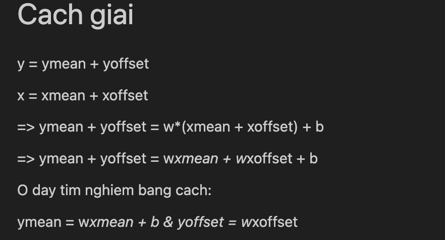

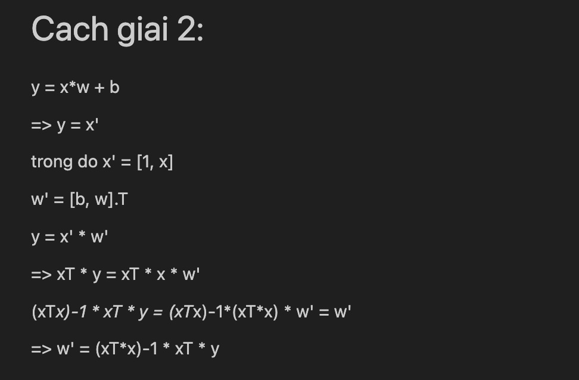

Code:

```python
x_temp = np.concatenate([np.ones((n, 1)), np.reshape(x, (n,1))], axis=1)

x_temp

w_temp = np.linalg.inv((x_temp.T) @ x_temp) @ (x_temp.T) @ y

w_temp

b = w_temp[0]
w = w_temp[1]
```

```python
ymean = y.mean()

xmean = x.mean()

ymean

yoffset = y - ymean 
xoffset = x - xmean 

yoffset

w = np.linalg.inv(((x_temp.T) @ x_temp))  @ (x_temp.T) @ y_temp

w

b = ymean - xmean*w 
b
```

Benchmark of Gradient descent vs Matrix

```python
import time
import numpy as np
from sklearn.linear_model import LinearRegression, SGDRegressor

def benchmark(n_samples, n_features):
    X = np.random.randn(n_samples, n_features)
    y = np.random.randn(n_samples)
    
    # LinearRegression
    start = time.time()
    try:
        LinearRegression().fit(X, y)
        lr_time = time.time() - start
    except Exception as e:
        lr_time = str(e)
    
    # SGDRegressor
    start = time.time()
    SGDRegressor(max_iter=1000).fit(X, y)
    sgd_time = time.time() - start
    
    return lr_time, sgd_time

sizes = [(1000, 1000), (2000, 2000), (5000, 5000), (10000, 1000), (1000, 10000)]
for n, d in sizes:
    print(f"n={n}, d={d}:", benchmark(n, d))

```

1. Linear regression assumption

| Giả thuyết | Cách kiểm định | Công cụ |
| --- | --- | --- |
| Tuyến tính | Vẽ biểu đồ residuals vs fitted values | sns.residplot() |
| Độc lập ( durbin-watson áp dụng với time series) | Kiểm định Durbin-Watson | durbin_watson() |
| Phương sai không đổi | Vẽ residuals vs fitted, kiểm định Breusch-Pagan | statsmodels |
| Phân phối chuẩn | Kiểm định Shapiro-Wilk hoặc vẽ histogram + Q-Q plot | shapiro(), qqplot() |
| Không đa cộng tuyến | Tính VIF (Variance Inflation Factor) | variance_inflation_factor() |

Phần dư residual (resid) cần tuân theo phân phôtis chuẩn, có phương sai không đổi 

Để kiểm chứng thường sẽ chạy Shapiro-wilk để tính ra p-value 

Shapiro-wilk: H0: resid tuân theo phân phối chuẩn

p-value < 0.05 → Bác bỏ H0

Tuy nhiên nếu mẫu lớn → Shapiro thường cho ra p-value < 0.05 nên sẽ cần thêm vẽ biểu đồ trực quan ra

Biểu đồ Q-Q

```python
import statsmodels.api as sm
import matplotlib.pyplot as plt

sm.qqplot(np.array(resid), line='45', fit=True)
plt.show()

```

Biểu đồ histogram

```python
import seaborn as sns
import matplotlib.pyplot as plt

sns.histplot(resid, kde=True)
plt.show()

```

Kiểm định đa cộng tuyến:

Sử dụng hàm variance_inflation_factor: https://en.wikipedia.org/wiki/Variance_inflation_factor

Bản chất là predict 1 feature Xi dựa vào các X còn lại, đo r square của mô hình 

Nếu VIF > 5 (tính ra thì là R2 > 0.8) thì biến i cần xem xét là bị đa cộng tuyến 

```python
import pandas as pd
from statsmodels.stats.outliers_influence import variance_inflation_factor
from statsmodels.tools.tools import add_constant

# Giả sử X là DataFrame chứa các biến độc lập
X = add_constant(x)   # thêm cột hằng số (intercept)

vif_data = pd.DataFrame()
vif_data["feature"] = X.columns
vif_data["VIF"] = [variance_inflation_factor(X.values, i) for i in range(X.shape[1])]

print(vif_data)
```

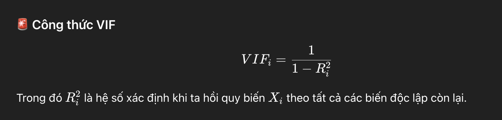

1. Xử lí khi bị các vấn đề 

Khi đã bị đa cộng tuyến, thì có những cách xử lí sau:

- Loại bớt biến giải thích (predictors) bị trùng lặp thông tin.
- Kết hợp các biến có tương quan cao (ví dụ tạo chỉ số tổng hợp).
- Sử dụng **Regularization methods** (Ridge, Lasso).

Cách 1: Bỏ bớt biến đi 

Cách 2: Kết hợp các biến = phương pháp PCA 

## 1️⃣ Eigenvalue là gì?

Cho 1 ma trận vuông AAA, ta giải phương trình:

Av = λv

A: n x n 

v: n x 1 

λ: 1 so float 

Av=λv

- vvv = **eigenvector** (vector riêng).
- λ\lambdaλ = **eigenvalue** (trị riêng).

Ý nghĩa: khi nhân ma trận A với vector v, ta chỉ thay đổi độ dài (scale) vector đó lên λ\lambdaλ lần, **mà không đổi hướng**.

Ví dụ: tưởng tượng vvv là một mũi tên, sau phép biến đổi tuyến tính AAA, mũi tên vẫn chỉ cùng hướng, chỉ dài ra hoặc ngắn lại.

## 2️⃣ Eigenvalues trong PCA có ý nghĩa gì?

Trong PCA:

- A chính là **ma trận hiệp phương sai** C.
- Eigenvalue của mỗi eigenvector cho biết **lượng phương sai dữ liệu giữ lại** trên trục đó.

➡️ **Eigenvalue càng lớn → trục (eigenvector) đó chứa nhiều thông tin hơn.**

## 3️⃣ Sử dụng eigenvalues để làm gì trong PCA?

- **Xếp hạng các trục PCA:** ta sắp xếp eigenvalues từ lớn đến nhỏ để biết trục nào quan trọng nhất.
- **Chọn số chiều kkk:** thường chọn kkk sao cho tổng eigenvalues chiếm đủ % phương sai (VD: 95%).

Công thức tính **variance explained ratio**:

Explained Variance Ratioi

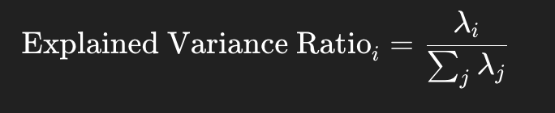

Khi đó t chọn top k trong m PCA 

→ Giữ lại được % lớn thông tin trong ma trận 

Tìm λ và v kiểu gì: → Khi A là n x n thì sẽ có n cặp (λ, v) 

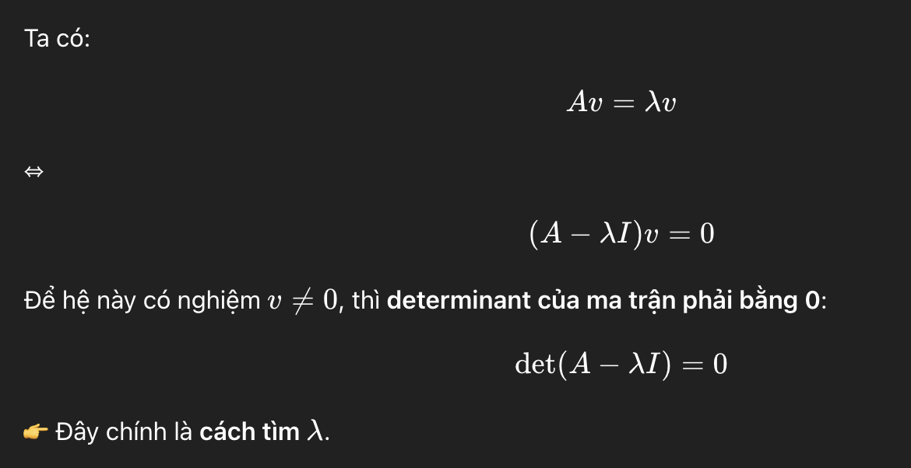

Sau đó lập ma trận gồm các [v] đây là ma trận mới vẫn giữ đủ thông tin của A 

Chọn top các hàng mà vẫn giữ được nhiều thông tin nhất 

→ Giảm được số chiều dữ liệu từ m → k 

Cách 3: Sử dụng Regulation Lasso và Ridge

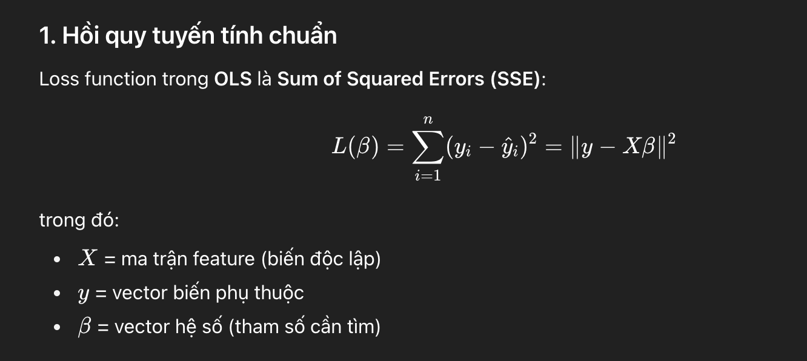

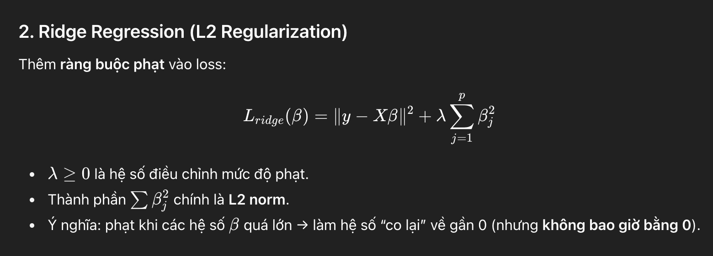

Cách giải:

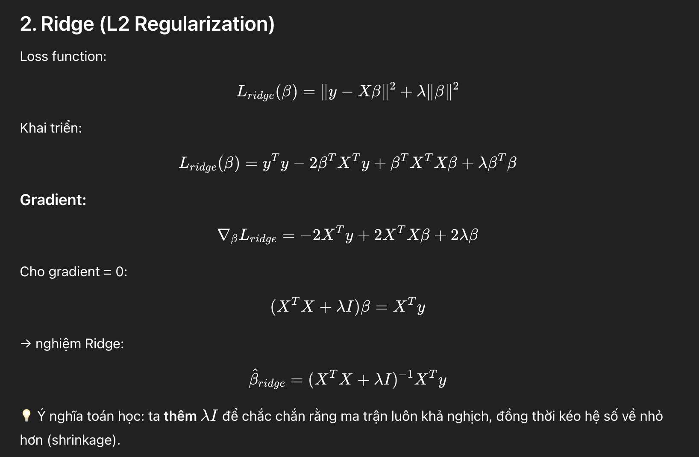

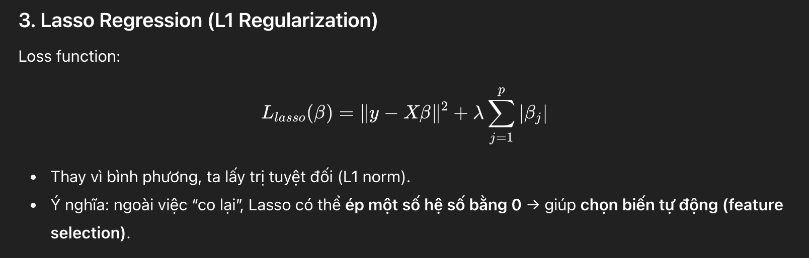

Cách giải: 

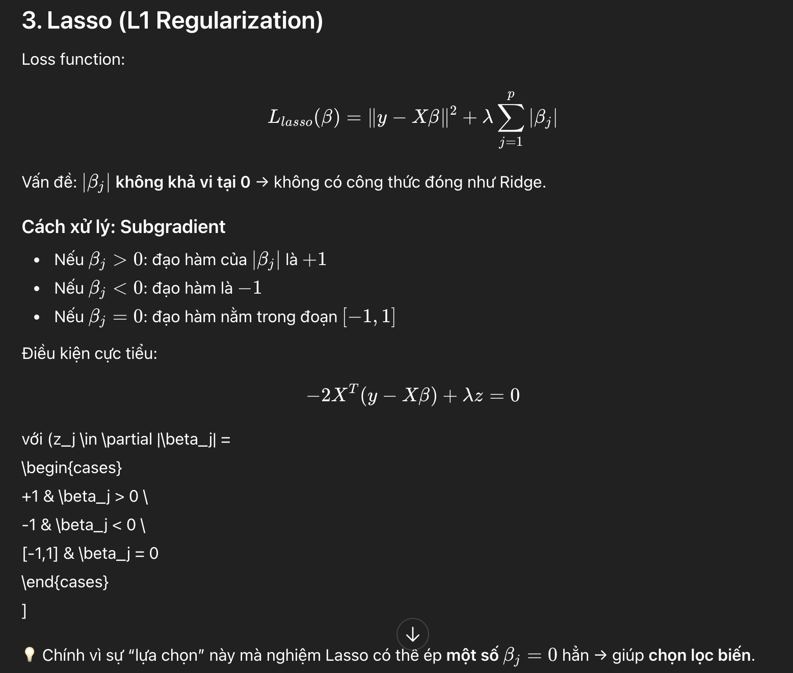