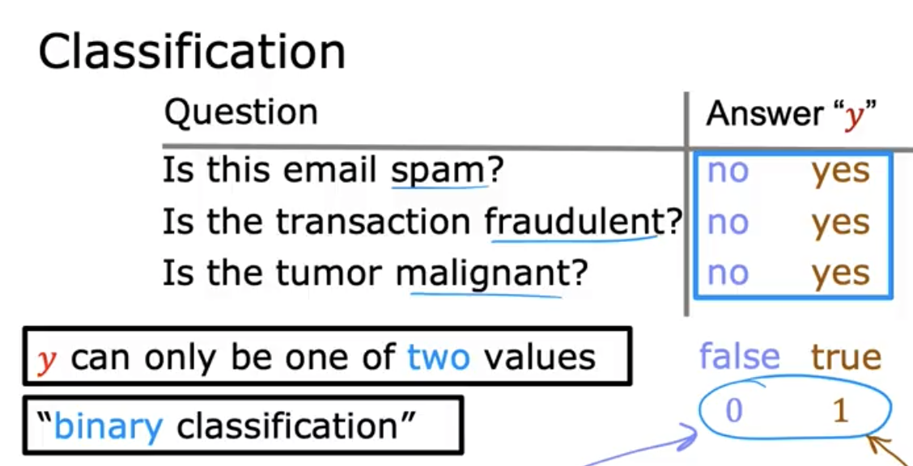
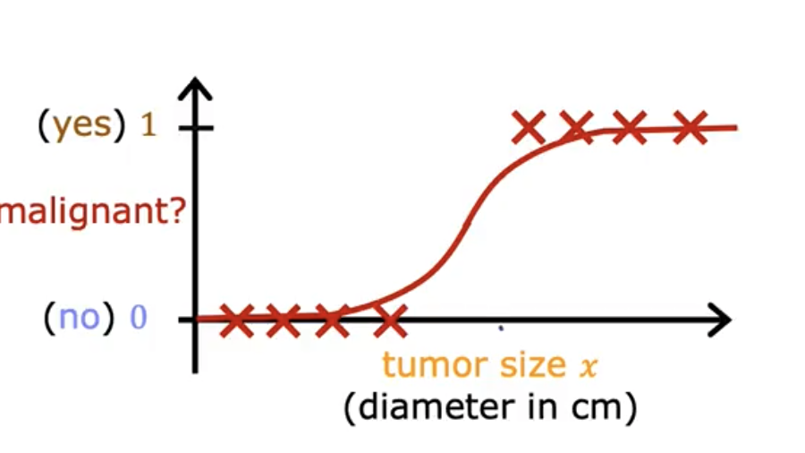
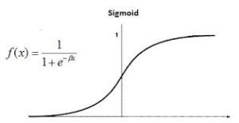

🔙 [Back to Home](/)

## Linear regression

## Definition



if still use linear regression, some case will be misclass

→ Use Logistic regression for classification problems



The most important of logistic regression is **sigmoid function** - a function which convert from [-∞, +∞] -> (0, 1). With the output (0,1) it can fit with classification problems (2 class).

So we will deep dive into sigmoid function first, then how apply in logistic regression.

sigmoid function (also called logistic function)

- output: between 0 and 1
- fomula g(z) = 1/ (1 + e^-z)
    
    → 0 < g(z) < 1
    

Logistic regression fomula:

z = w*x + b

g(z) = 1/ (1+e^-z)

Idea:

When plot the values of x, y  → think out of sigmoid function f(x) = 1 / (1 + e^-bx)



Then process bx = log(p / 1-p)

Then write the Loss function → calculate derivative (gradient descent)    
**Important**
This is call odd function: log(p / 1-p)
This function have transform from (0,1) -> [-∞, +∞].   
Also this fomula bx = odd_function = log(p / 1-p) can help to undestand relationship between x and odd_value (like [Linear Regression](../linear_regression/))


## Code from scratch

```python
def predict(x, alpha, beta):
    # Clip z to prevent overflow but keep continuous output
    z = alpha * x + beta
    z = max(min(z, 10), -10)  # clip between -10 and 10
    return 1.0 / (1.0 + math.exp(-z))
    
def logistic_regression_scratch(x, y, alpha_init=0, beta_init=0, learning_rate=0.01, epochs=101):
    alpha = alpha_init
    beta = beta_init

    n = len(y)

    for run in range(epochs):
        loss = 0
        update_alpha = 0
        update_beta = 0

        for i in range(n):
            z = alpha*x[i] + beta
            y_pred = 1 / (1 + np.exp(-z))  # sigmoid

            # cross-entropy loss
            loss += (-1/n) * (y[i]*np.log(y_pred + 1e-9) + (1 - y[i])*np.log(1 - y_pred + 1e-9))

            # gradients
            update_alpha += (y_pred - y[i])* x[i]
            update_beta += (y_pred - y[i]) 

        alpha -= learning_rate * (update_alpha / n)
        beta  -= learning_rate * (update_beta / n)

        if run % 100 == 0:
            print(f"Epoch {run}: Loss = {loss:.4f}, alpha = {alpha:.4f}, beta = {beta:.4f}")

    return alpha, beta
    
def predict_scratch(x, alpha, beta, threshold=0.5):
    prob = [1/(1 + math.exp(-(ele*alpha + beta))) for ele in x]
    
    return [int(ele >= threshold) for ele in prob]

y_pred_all = [predict(xi, alpha, beta) for xi in x]

y_pred_all
    
```


## Some value idea

1. Handle missing data
    
    When check profile data, there some missing values, if dropna → drop too much value
    
    So need to fill in that missing values:
    
    - When fill 0: when the missing mean no, example Amt_transaction: missing mean no transaction
    - When fill mean: when the column data is near normal-distribution
    - When fill median: when the column data is skew

2. Transform columnsL sin cos to datetime values
    
    When dealing with date data, can have the sin/cos values based on date format
    
3. Permutation importance
    
    In docs in library code:
    
    ```python
        The :term:`estimator` is required to be a fitted estimator. `X` can be the
        data set used to train the estimator or a hold-out set. The permutation
        importance of a feature is calculated as follows. First, a baseline metric,
        defined by :term:`scoring`, is evaluated on a (potentially different)
        dataset defined by the `X`. Next, a feature column from the validation set
        is permuted and the metric is evaluated again. The permutation importance
        is defined to be the difference between the baseline metric and metric from
        permutating the feature column.
    
        Read more in the :ref:`User Guide <permutation_importance>`.
    ```
    
4. Shap values
[Further reading/ blog]