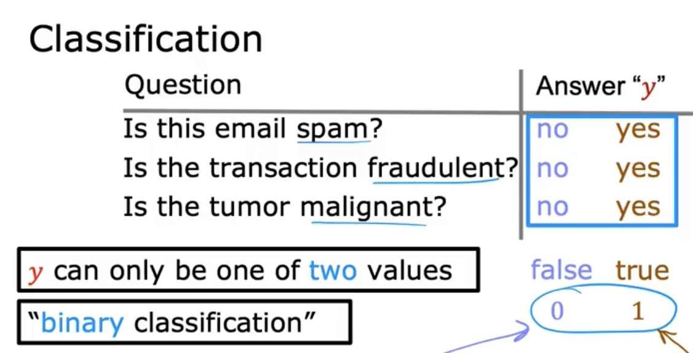
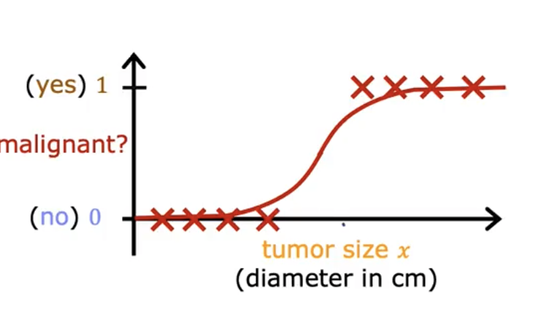
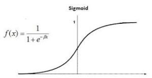

🔙 [Back to Home](/)

## Why not Linear Regression for Classification?



If we still use linear regression for classification, some cases will be misclassified because the fitted line is sensitive to outliers, and the predicted value can run outside the [0, 1] bounds.

→ **Use Logistic regression for classification problems**



## Definition & The Sigmoid Function

The most important component of logistic regression is the **sigmoid function** - a function which transforms values from $(-\infty, +\infty)$ to $(0, 1)$. With the output bound between 0 and 1, it naturally fits classification problems (binary classification).

### The Sigmoid Function (Logistic Function)
- **Output:** between 0 and 1
- **Formula:** $g(z) = \frac{1}{1 + e^{-z}}$
- Therefore, $0 < g(z) < 1$

### Logistic Regression Formula:
$z = w \cdot x + b$

$y_{pred} = g(z) = \frac{1}{1 + e^{-z}}$

**Idea:**
When visualizing the values of x and y, think of the sigmoid function: 
$f(x) = \frac{1}{1 + e^{-(wx+b)}}$



### The Logit Function (Log-Odds)
If we process the formula mathematically, we get:
$wx + b = \log\left(\frac{p}{1-p}\right)$

**Important Technical Note:**
- The ratio $\frac{p}{1-p}$ is called the **Odds**.
- The function $\log\left(\frac{p}{1-p}\right)$ is called the **Logit function** or **Log-odds** function.
- This function transforms values from the probability range $(0,1)$ back to the continuous range $(-\infty, +\infty)$.
- This formula $wx + b = \text{logit}(p)$ shows the linear relationship between x and the log-odds (similar to [Linear Regression](../linear_regression/)).

By defining the Loss function (Cross-Entropy Loss), we can calculate the derivatives and use Gradient Descent to find the optimal weights $w$ and $b$.

## Code from scratch

```python
import math
import numpy as np

def predict(x, alpha, beta):
    # Clip z to prevent overflow when calculating exp, keeping output continuous
    z = alpha * x + beta
    z = max(min(z, 10), -10)  # clip between -10 and 10 for stability
    return 1.0 / (1.0 + math.exp(-z))
    
def logistic_regression_scratch(x, y, alpha_init=0, beta_init=0, learning_rate=0.01, epochs=101):
    alpha = alpha_init
    beta = beta_init

    n = len(y)

    for run in range(epochs):
        loss = 0
        update_alpha = 0
        update_beta = 0

        for i in range(n):
            z = alpha * x[i] + beta
            z = max(min(z, 10), -10) # clip to avoid overflow
            y_pred = 1 / (1 + np.exp(-z))  # sigmoid

            # cross-entropy loss
            loss += (-1/n) * (y[i] * np.log(y_pred + 1e-9) + (1 - y[i]) * np.log(1 - y_pred + 1e-9))

            # gradients
            update_alpha += (y_pred - y[i]) * x[i]
            update_beta += (y_pred - y[i]) 

        # Update weights
        alpha -= learning_rate * (update_alpha / n)
        beta  -= learning_rate * (update_beta / n)

        if run % 100 == 0:
            print(f"Epoch {run}: Loss = {loss:.4f}, alpha = {alpha:.4f}, beta = {beta:.4f}")

    return alpha, beta
    
def predict_scratch(x, alpha, beta, threshold=0.5):
    # Calculate probability and apply threshold for final class prediction
    prob = [1 / (1 + math.exp(-(ele * alpha + beta))) for ele in x]
    return [int(ele >= threshold) for ele in prob]

# Example usage (assuming x, y are defined)
# y_pred_all = [predict(xi, alpha, beta) for xi in x]
# print(y_pred_all)
```

## Best Practices in Practical Modeling

*(These are general machine learning tips that are heavily used alongside Logistic Regression in practical projects)*

1. **Handling Missing Data**
   When checking profile data, there might be missing values. Using `dropna` might drop too much useful data. We need to impute those missing values:
   - **Fill with 0:** When missing data implies "no" or "none" (e.g., `Amt_transaction`: missing means no transaction occurred).
   - **Fill with Mean:** When the column data follows a near-normal distribution.
   - **Fill with Median:** When the column data is strongly skewed.

2. **Transforming Features (e.g., Datetime)**
   When dealing with cyclical data like dates or times, extracting elements and applying `sin` / `cos` transformations can help the model capture periodic patterns.

3. **Permutation Importance**
   A great way to explain models (including Logistic Regression):
   > "First, a baseline metric is evaluated on a dataset. Next, a feature column from the validation set is permuted (shuffled), and the metric is evaluated again. The permutation importance is defined to be the difference between the baseline metric and metric from permutating the feature column."

4. **SHAP Values**
   Useful for model interpretability, helping to explain the contribution of each feature to the log-odds prediction.
   
[Further reading/ blog]