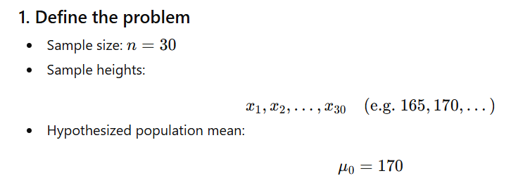
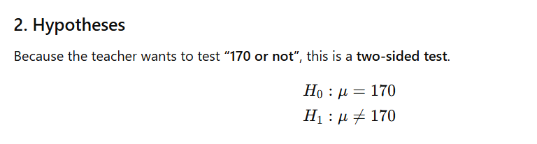
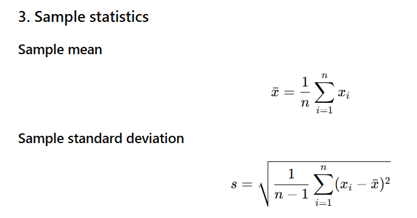
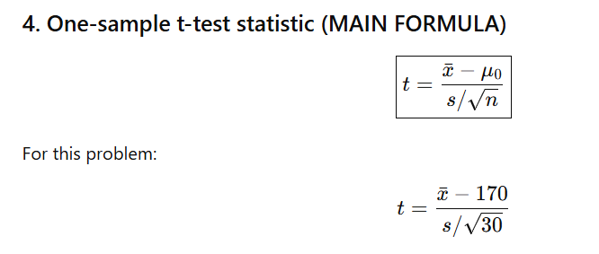
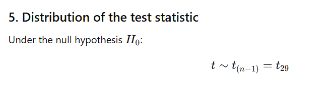
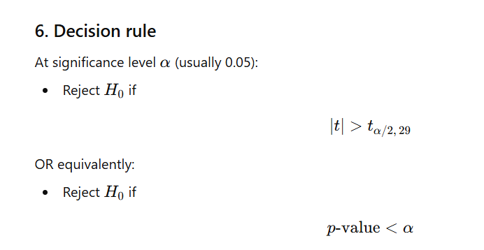
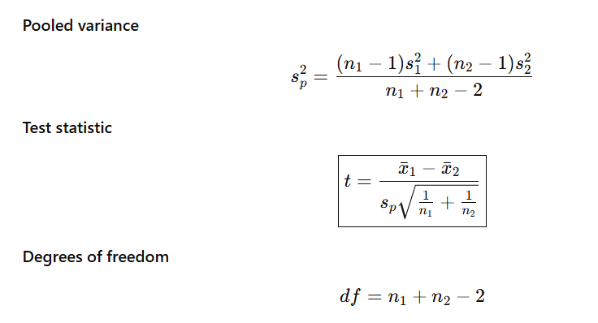

🔙 [Back to Home](/)

## T - test

Link tham khao: https://www.cuemath.com/t-test-formula/ 

## I. Type of T-test

1. One-sample t-test

For comparing the mean of a population ¯x from n samples, with a specified theoretical mean μ, we use a one-sample t-test.

1. Independent sample T-test 

Students t-test is used to compare the mean of two groups of samples.

It helps evaluate if the means of the two sets of data are statistically significantly different from each other. 

1. Paired T-test
- A paired samples t-test and an independent samples t-test are both used to compare means, but they differ in how the data is collected and related.
- A paired t-test compares the means of two related groups, often from the same subjects measured at different times or under different conditions. An independent t-test compares the means of two unrelated groups.

## II. How T-test are used

1. Hypothesis testing 

2. Significance

If the calculated t-value exceeds the critical value (based on the chosen significance level and degrees of freedom), the null hypothesis is rejected, suggesting a statistically significant difference

3. Interpreting T-value
- A larger absolute t-value suggests a greater difference between the sample means
- The larger the t-value (the further away from zero), the stronger the evidence against the null hypothesis
- The sign of the t-value (+ or -) indicates the direction of the difference between the means

## III. Example

A class has 30 students, with height [165, 170, ...]
Teacher want to test if average height of students is 170 or not

--> Use T-test 1 sample in this 
1. T-test 1 sample

2. T-test 2 sample

Have 2 class, the teacher want to test if any different in height between these 2 class.

