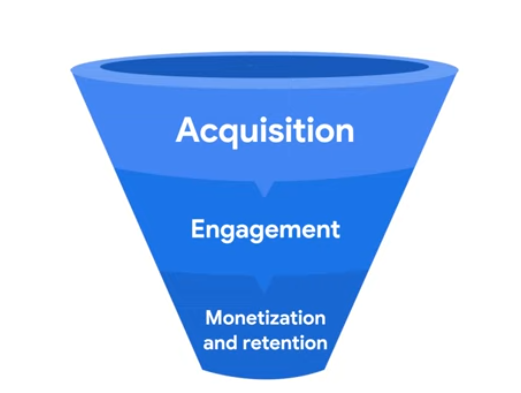
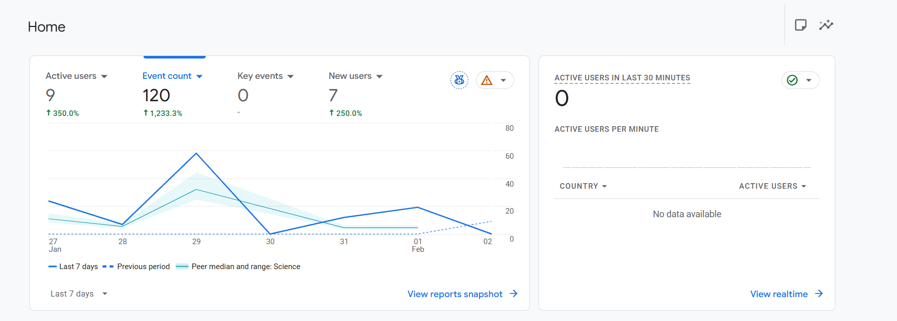
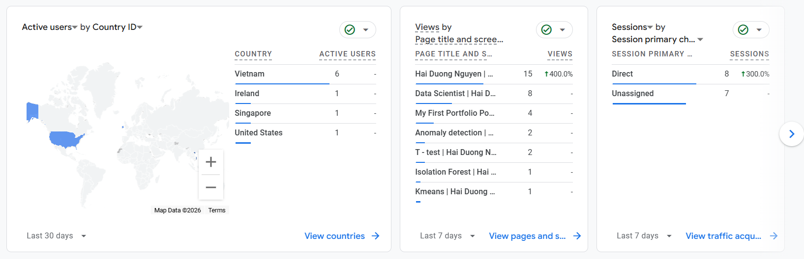
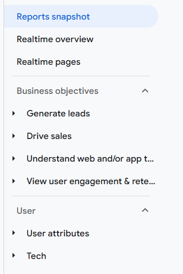

Date: 2026-01-26

Link reference: https://support.google.com/analytics/answer/10089681?hl=vi&ref_topic=14089939&sjid=5418224013262677673-NC

1. Introduction

Kể từ **ngày 1 tháng 7 năm 2023**, các tài sản Universal Analytics chuẩn đã ngừng xử lý dữ liệu. Bạn sẽ có thể xem báo cáo Universal Analytics trong một khoảng thời gian sau ngày 1 tháng 7 năm 2023. 
---
title: T - test
---

🔙 [Back to Home](/)

## Overall about GA4

1. Course learn to use GA4 

https://skillshop.docebosaas.com/learn/courses/8108/get-started-using-google-analytics/lessons/24354:8107/welcome-to-the-course-html-page 



acquisition: what marketing channel bring customer

engagement: what content users engage with and share with others

monetization & retention: how many user become customers and how often they return website


## Set up

1. Create account of google analytics

2. Set up new website tracking projects

3. Add this block code to html file   

```
<!-- Google tag (gtag.js) -->
<script async src="https://www.googletagmanager.com/gtag/js?id=G-xxxxxxx"></script>
<script>
  window.dataLayer = window.dataLayer || [];
  function gtag(){dataLayer.push(arguments);}
  gtag('js', new Date());
  gtag('config', 'G-xxxxxxx');
</script>
```

4. Test connect

5. Production

## Default reports of GA4

- Number cus & Number events :  



- Users by country/ pages view/ channel   



- Reports built in



## Customer reports

<To be continue>   
Will be updated if this blog has more users access :>   