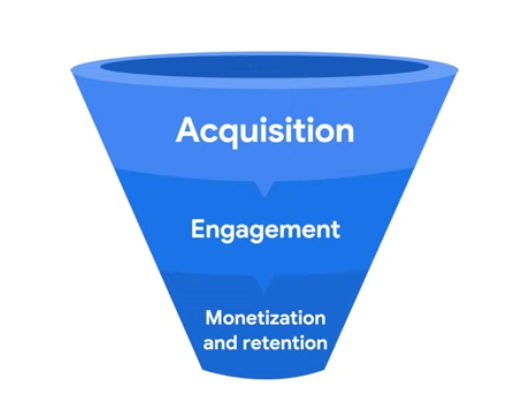


🔙 [Back to Home](/)

# GA4 for This Blog: A Page View Does Not Capture Language Choice

The English and Vietnamese versions of an article share one URL on this site. When a reader switches language, the page does not reload, so another `page_view` is not generated. Counting page views alone therefore cannot answer which language the reader chose.

This is the practical consequence of GA4's event-based model: measurement begins with a decision and the interaction that represents it, not with a list of available reports.

## The blog needs four measurements, not every possible event

| Reader behavior | Measurement | Decision it supports |
| --- | --- | --- |
| Opens an article | `page_view` with page path and title | Which articles attract visits? |
| Changes EN/VI | A custom `language_change` event | Which language is actively selected on each article? |
| Reaches the end of a long article | A defined reading-depth event | Which articles are opened but not substantially read? |
| Opens Finance in Banking | A dedicated navigation event | Does the blog lead readers to the interactive banking project? |

The current site has the Google tag and standard page collection, but its language-switch code does not send a custom analytics event. `language_change` is therefore a measurement proposal, not a claim about data already being collected.

## The reporting funnel asks three different questions

- **Acquisition:** which channels bring users to the site?
- **Engagement:** which pages and interactions hold their attention?
- **Monetization and retention:** which users become customers, and how often do they return?

These stages should not be collapsed into one traffic number. Acquisition explains arrival, engagement explains behavior after arrival, and retention explains whether users come back.

For a personal technical blog, monetization is not the first useful goal. Article discovery, meaningful reading, language preference, and navigation to a project are closer to the actual decisions the site can improve.

## Events are the data model, but sessions still exist

Standard Universal Analytics stopped processing new data on July 1, 2023. It organized reporting mainly around sessions and pageviews. GA4 represents interactions such as page views, clicks, scrolls, and key events as events. Event parameters carry additional context about each interaction.

It is more accurate to say that GA4 is **event-based** than to say that it has no sessions. GA4 still reports session-related metrics; they are derived within its event-based model.

This distinction matters when moving an old report. A UA metric should not be copied into GA4 merely because a field has a similar name—the event definition and session logic may have changed underneath it.

It also matters on this site. A language change is an event inside one page session; inventing a second page view would inflate content traffic and still fail to describe what happened.

## GA4 connects web and app behavior through the same model

An event-based structure can represent interactions from websites and applications without requiring pageviews to be the central unit. Reports then aggregate those events into dimensions and metrics:

- A **dimension** describes an event or user, such as page title, country, or traffic channel.
- A **metric** counts or measures it, such as active users, views, event count, or sessions.

The useful question is therefore not “Which report should I open?” but “Which event, parameter, dimension, and metric represent the behavior I want to understand?”

## Parameters need a reporting plan

A `language_change` event could carry the selected language and page path. Sending a parameter does not automatically make every custom value convenient to use in standard reports; a corresponding custom dimension may be needed when that parameter must be analyzed as a reporting dimension.

Event names and parameters should remain stable after release. Changing `language_change` to several similar names later would fragment one behavior across multiple rows. The event should also avoid personal or customer information; article language and page path are sufficient for this question.

## Collection and consent are separate decisions

The site's language preference is stored locally for functionality. Analytics storage is a different purpose. The current Google tag loads directly from the shared page head, so any consent behavior required for the intended audience and configuration must be designed explicitly rather than assumed from the presence of a privacy page.

## Continue with the implementation on this site

The next note shows how I added the Google tag once to the shared Jekyll layout and verified the data in GA4: [Set up GA4 on GitHub Pages](./setup.html).

References: [Google Analytics Help — events](https://support.google.com/analytics/answer/9322688?hl=en), [Google Analytics Help — custom dimensions and metrics](https://support.google.com/analytics/answer/14240153?hl=en), and [Google Analytics Help — consent types](https://support.google.com/analytics/answer/12334711?hl=en).

<article class="reading-page" data-lang="en">{{ article_en | markdownify }}</article>


🔙 [Quay lại trang chủ](/)

# GA4 cho blog này: page view không ghi nhận lựa chọn ngôn ngữ

Hai bản English và Vietnamese của một bài dùng chung URL trên website này. Khi người đọc đổi ngôn ngữ, page không reload nên không có `page_view` mới. Vì vậy, chỉ đếm page view không thể trả lời người đọc đã chọn ngôn ngữ nào.

Đây là hệ quả thực tế của event-based model trong GA4: measurement bắt đầu từ một quyết định và interaction đại diện cho nó, không bắt đầu từ danh sách report có sẵn.

## Blog cần bốn measurement, không cần mọi event có thể tạo

| Hành vi người đọc | Measurement | Quyết định được hỗ trợ |
| --- | --- | --- |
| Mở một bài viết | `page_view` cùng page path và title | Bài nào thu hút lượt truy cập? |
| Chuyển EN/VI | Custom event `language_change` | Ngôn ngữ nào được chủ động chọn trên từng bài? |
| Đọc đến cuối một bài dài | Reading-depth event được định nghĩa rõ | Bài nào được mở nhưng không được đọc đáng kể? |
| Mở Finance in Banking | Navigation event riêng | Blog có dẫn người đọc sang interactive banking project không? |

Website hiện đã có Google tag và standard page collection, nhưng language-switch code chưa gửi custom analytics event. Vì vậy, `language_change` là measurement proposal, không phải claim rằng dữ liệu này đã được thu thập.

## Reporting funnel trả lời ba câu hỏi khác nhau

- **Acquisition:** những channel nào đưa người dùng đến website?
- **Engagement:** những page và interaction nào giữ được sự chú ý của họ?
- **Monetization và retention:** người dùng nào trở thành khách hàng, và họ quay lại thường xuyên đến đâu?

Không nên gộp ba giai đoạn này thành một con số traffic. Acquisition giải thích người dùng đến từ đâu, engagement giải thích behavior sau khi họ đến, còn retention cho biết họ có quay lại hay không.

Với một technical blog cá nhân, monetization chưa phải mục tiêu hữu ích đầu tiên. Article discovery, meaningful reading, language preference và điều hướng sang project gần hơn với các quyết định website thực sự có thể cải thiện.

## Event là data model, nhưng session vẫn tồn tại

Standard Universal Analytics ngừng xử lý dữ liệu mới từ ngày 1 tháng 7 năm 2023. Nó tổ chức report chủ yếu quanh session và pageview. GA4 biểu diễn các interaction như page view, click, scroll và key event dưới dạng event. Event parameter cung cấp thêm context cho từng interaction.

Nói GA4 **event-based** chính xác hơn nói rằng GA4 không có session. GA4 vẫn báo cáo session-related metric; các metric này được suy ra trong event-based model.

Khác biệt này quan trọng khi chuyển một report cũ. Không nên copy một UA metric sang GA4 chỉ vì field có tên tương tự—event definition và session logic bên dưới có thể đã thay đổi.

Điều này cũng quan trọng với website hiện tại. Đổi ngôn ngữ là một event bên trong cùng page session; tạo thêm page view sẽ làm traffic bị phóng đại mà vẫn không mô tả đúng điều đã xảy ra.

## GA4 kết nối behavior trên web và app bằng cùng một model

Event-based structure có thể biểu diễn interaction từ website và application mà không cần lấy pageview làm đơn vị trung tâm. Report sau đó tổng hợp các event thành dimension và metric:

- **Dimension** mô tả event hoặc user, chẳng hạn page title, country hoặc traffic channel.
- **Metric** đếm hoặc đo lường chúng, chẳng hạn active user, view, event count hoặc session.

Vì vậy, câu hỏi hữu ích không phải là “Tôi nên mở report nào?” mà là “Event, parameter, dimension và metric nào biểu diễn behavior tôi muốn hiểu?”

## Parameter cần một reporting plan

Event `language_change` có thể mang selected language và page path. Gửi parameter không tự động làm mọi custom value thuận tiện trong standard report; có thể cần custom dimension tương ứng khi parameter đó phải được phân tích như reporting dimension.

Event name và parameter cần ổn định sau khi release. Nếu sau này đổi `language_change` thành nhiều tên gần giống, cùng một behavior sẽ bị chia thành nhiều dòng. Event cũng không nên chứa personal hoặc customer information; article language và page path đã đủ cho câu hỏi này.

## Collection và consent là hai quyết định riêng

Language preference của website được lưu local để phục vụ chức năng. Analytics storage có mục đích khác. Google tag hiện được load trực tiếp từ shared page head, nên consent behavior cần thiết cho audience và configuration dự kiến phải được thiết kế rõ ràng, không thể suy ra chỉ từ việc website có privacy page.

## Tiếp tục với phần triển khai trên website này

Ghi chú tiếp theo trình bày cách tôi thêm Google tag một lần vào shared Jekyll layout và kiểm tra dữ liệu trong GA4: [Thiết lập GA4 trên GitHub Pages](./setup.html).

Tham khảo: [Google Analytics Help — events](https://support.google.com/analytics/answer/9322688?hl=en), [Google Analytics Help — custom dimensions và metrics](https://support.google.com/analytics/answer/14240153?hl=en) và [Google Analytics Help — consent types](https://support.google.com/analytics/answer/12334711?hl=en).

<article class="reading-page" data-lang="vi">{{ article_vi | markdownify }}</article>
