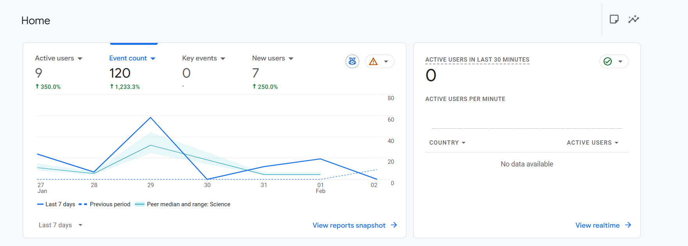
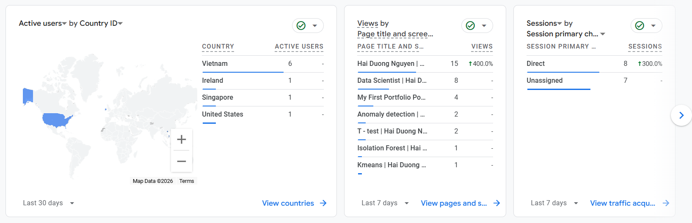
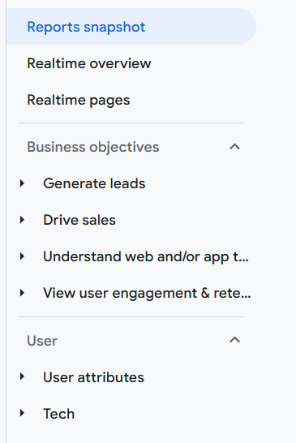


🔙 [Back to Home](/)

# Add GA4 to Jekyll Once, Then Verify Three Layers

A GitHub Pages site may contain many generated HTML pages, but the GA4 tag should have one source of truth. On this Jekyll site, I put it in a shared head include so every page receives the tag during the build.

## Create a web data stream and keep its Measurement ID

In Google Analytics:

1. Create or select an Analytics account.
2. Create a GA4 property.
3. Add the website URL as a Web data stream.
4. Copy the Measurement ID in the form `G-XXXXXXXXXX`.

The Measurement ID connects browser events from the site to the correct GA4 data stream.

## Put the Google tag in the shared Jekyll head

The original `gtag.js` snippet is:

```html
<!-- Google tag (gtag.js) -->
<script async src="https://www.googletagmanager.com/gtag/js?id=G-XXXXXXXXXX"></script>
<script>
  window.dataLayer = window.dataLayer || [];
  function gtag(){dataLayer.push(arguments);}
  gtag('js', new Date());

  gtag('config', 'G-XXXXXXXXXX');
</script>
```

Replace both occurrences of `G-XXXXXXXXXX` with the Measurement ID. This site stores the snippet in `_includes/head-custom.html`, which is included once by `_layouts/default.html`.

Putting the snippet in each Markdown article would duplicate configuration and make future changes harder. The shared include also makes it possible to check one source file while Jekyll distributes the tag to every generated page.

This setup uses `gtag.js` directly; it does not require Google Tag Manager.

## Verify the source, the browser, and GA4

After building and deploying, check three layers:

1. **Generated HTML:** open page source and confirm that the Measurement ID appears once.
2. **Browser request:** open Developer Tools and confirm that the Google tag loads and sends a collection request. An ad blocker may prevent this request.
3. **GA4 Realtime:** visit the site in another tab and confirm that an active user or event appears.

If Realtime remains empty, first check the Measurement ID, duplicate or missing tags, deployment status, and browser blocking. There is little value in interpreting reports until this collection path works.

## The first reports confirm more than installation

The Home report below shows active users, new users, event count, and the Realtime panel. It confirms that GA4 is receiving events, but the small early sample should not be treated as a stable traffic pattern.



The next card group breaks the same traffic into country, page title, and session acquisition channel:



GA4 also organizes built-in reports around business objectives, user attributes, and technology:



These reports become useful only after their underlying events and dimensions match the questions being asked. Custom events and reports should come after the default collection has been verified and understood.

<article class="reading-page" data-lang="en">{{ article_en | markdownify }}</article>


🔙 [Quay lại trang chủ](/)

# Thêm GA4 vào Jekyll một lần, sau đó kiểm tra ba lớp

Một website GitHub Pages có thể có nhiều HTML page được generate, nhưng GA4 tag chỉ nên có một source of truth. Trên Jekyll site này, tôi đặt tag trong shared head include để mỗi page đều nhận tag khi build.

## Tạo web data stream và lưu Measurement ID

Trong Google Analytics:

1. Tạo hoặc chọn một Analytics account.
2. Tạo GA4 property.
3. Thêm URL của website dưới dạng Web data stream.
4. Copy Measurement ID có dạng `G-XXXXXXXXXX`.

Measurement ID kết nối browser event từ website với đúng GA4 data stream.

## Đặt Google tag trong shared Jekyll head

Snippet `gtag.js` gốc là:

```html
<!-- Google tag (gtag.js) -->
<script async src="https://www.googletagmanager.com/gtag/js?id=G-XXXXXXXXXX"></script>
<script>
  window.dataLayer = window.dataLayer || [];
  function gtag(){dataLayer.push(arguments);}
  gtag('js', new Date());

  gtag('config', 'G-XXXXXXXXXX');
</script>
```

Thay cả hai vị trí `G-XXXXXXXXXX` bằng Measurement ID. Website này lưu snippet trong `_includes/head-custom.html`, và `_layouts/default.html` include file đó đúng một lần.

Nếu đặt snippet trong từng bài Markdown, cấu hình sẽ bị lặp và khó thay đổi về sau. Shared include cũng giúp chỉ cần kiểm tra một source file trong khi Jekyll phân phối tag đến mọi generated page.

Setup này sử dụng trực tiếp `gtag.js`; không yêu cầu Google Tag Manager.

## Kiểm tra source, browser và GA4

Sau khi build và deploy, kiểm tra ba lớp:

1. **Generated HTML:** mở page source và xác nhận Measurement ID chỉ xuất hiện một lần.
2. **Browser request:** mở Developer Tools và xác nhận Google tag được load rồi gửi collection request. Ad blocker có thể chặn request này.
3. **GA4 Realtime:** truy cập website ở tab khác và xác nhận có active user hoặc event xuất hiện.

Nếu Realtime vẫn trống, trước tiên hãy kiểm tra Measurement ID, tag bị lặp hoặc thiếu, deployment status và browser blocking. Chưa nên diễn giải report khi collection path này chưa hoạt động.

## Những report đầu tiên xác nhận nhiều hơn việc cài đặt

Home report dưới đây hiển thị active user, new user, event count và Realtime panel. Nó xác nhận GA4 đang nhận event, nhưng sample nhỏ ban đầu chưa thể được xem là một traffic pattern ổn định.


Nhóm card tiếp theo phân tách cùng lượng traffic theo country, page title và session acquisition channel:


GA4 cũng tổ chức built-in report theo business objective, user attribute và technology:


Các report này chỉ hữu ích khi event và dimension bên dưới phù hợp với câu hỏi cần trả lời. Chỉ nên tạo custom event và report sau khi default collection đã được kiểm tra và hiểu rõ.

<article class="reading-page" data-lang="vi">{{ article_vi | markdownify }}</article>
